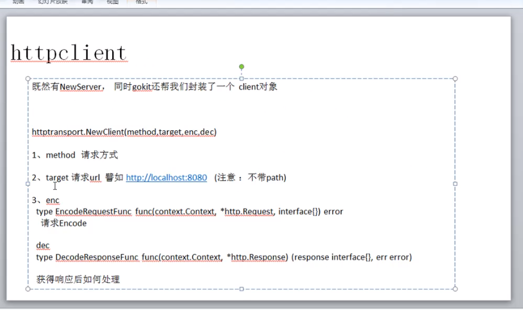
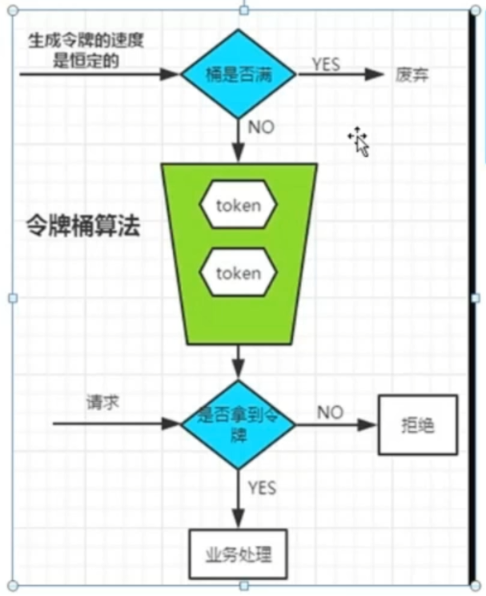
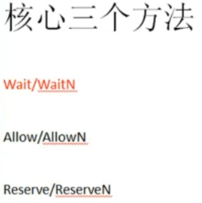

## 		项目基本信息

### 关于go-kit

>https://github.com/go-kit/kit

优秀的微服务工具包合集，利用它提供的API和规范可以创建健壮，可维护性高的微服务体系。


文档：

https://godoc.org/github.com/go-kit/kit


安装：

```go
go get github.com/go-kit/kit
```


类似框架：

- https://github.com/micro/go-micro
- https://github.com/koding/kite

### 微服务体系的基本需求（非全部

1. HTTPREST、RPC
2. 日志功能
3. 限流
4. API监控
5. 服务注册与发现
6. API网关服务链路追踪
7. 服务熔断

### Go-kit的三层架构

1. Transport

   主要负责与HTTP、gRPC、thrift等相关的逻辑

2. Endpoint
   定义Request和Response格式，并可以使用装饰器包装函数，
   以此来实现各种中间件嵌套。

3. Service
   这里就是我们的业务类、接口等

> 定义顺序是：Service -> Endpoint -> Transport

### 三层架构定义

#### UserService.go

```go
package Services

// 定义接口
type IUserService interface {
	GetName(userid int) string
}

// 定义结构体
type UserService struct{}

// 实现接口
func (userService UserService) GetName(userid int) string {
	if userid == 101 {
		return "jerry"
	}
	return "guest"
}

```

#### UserEndPoint.go

```go
package Services

import (
	"context"
	"github.com/go-kit/kit/endpoint"
)

// 封装User请求结构体
type UserRequest struct {
	Uid int `json:"uid"`
}

// 封装User响应结构体
type UserResponse struct {
	Result string `json:"result"`
}

// 生成User端点：通过实现endpoint.Endpoint接口来生成User端点
// 相当于以及获取了request信息 然后根据类型调用函数
func GenUserEndPoint(userService IUserService) endpoint.Endpoint {
	return func(ctx context.Context, request interface{}) (response interface{}, err error) {
		r := request.(UserRequest) //通过类型断言获取请求结构体
		result := userService.GetName(r.Uid)
		return UserResponse{Result: result}, nil
	}
}

```

#### UserTransport.go

```go
package Services

import (
	"context"
	"encoding/json"
	"errors"
	"net/http"
	"strconv"
)

// 例如封装浏览器的请求url->request
func DecodeUserRequest(c context.Context, r *http.Request) (interface{}, error) { //这个函数决定了使用哪个request结构体来请求
	if r.URL.Query().Get("uid") != "" {
		uid, _ := strconv.Atoi(r.URL.Query().Get("uid"))
		return UserRequest{Uid: uid}, nil
	}
	return nil, errors.New("参数错误")
}

// 封装服务器根据request生成的结果response：使得结果展现为json格式在屏幕中
func EncodeUserResponse(ctx context.Context, w http.ResponseWriter, response interface{}) error {
	w.Header().Set("Content-type", "application/json") //设置响应格式为json，这样客户端接收到的值就是json，就是把我们设置的UserResponse给json化了
	return json.NewEncoder(w).Encode(response)         //判断响应格式是否正确
}

```

> 一般是三层架构三个文件夹，我这里演示方便把三层的东西都放到了一个中
>
> 多理一下这三者间的关系就没问题

## HTTP服务

使用kit跑起HTTP服务

### 不带路由信息

#### main.go

```go
package main

import (
	"net/http"    // Import the missing package
	"p4/Services" //引入我们的服务包  这里不使用 . 导入容易发生命名冲突

	httptransport "github.com/go-kit/kit/transport/http"
)

func main() {
	user := Services.UserService{}
	endp := Services.GenUserEndPoint(user)

	serverHandler := httptransport.NewServer(endp, Services.DecodeUserRequest, Services.EncodeUserResponse)
	http.ListenAndServe(":12345", serverHandler) // ListenAndServe是go内置的包
}

```

http://127.0.0.1:8080/

返回结果：

```
参数错误
```

http://127.0.0.1:8080/?uid=101

返回结果：


http://127.0.0.1:8080/?uid=10190

返回结果：


### 带路由信息


#### main.go

```go
package main

import (
	httptransport "github.com/go-kit/kit/transport/http"
	"github.com/gorilla/mux"
	"net/http"
	"p4/Services"
)

func main() {
	user := Services.UserService{}
	endp := Services.GenUserEndPoint(user)

	serverHandler := httptransport.NewServer(endp, Services.DecodeUserRequest, Services.EncodeUserResponse) //使用go kit创建server传入我们之前定义的两个解析函数

	r := mux.NewRouter() //使用mux来使服务支持路由
	//r.Handle(`/user/{uid:\d+}`, serverHandler) //这种写法支持多种请求方法，访问Examp: http://localhost:8080/user/121便可以访问
	r.Methods("GET").Path(`/user/{uid:\d+}`).Handler(serverHandler) //这种写法限定了请求只支持GET方法
	http.ListenAndServe(":8080", r)

}
```

修改`UserTransport`的`DecodeUserRequest`函数

```go
func DecodeUserRequest(c context.Context, r *http.Request) (interface{}, error) { //这个函数决定了使用哪个request来请求
	vars := mux.Vars(r)             //通过这个返回一个map，map中存放的是参数key和值，因为我们路由地址是这样的/user/{uid:\d+}，索引参数是uid,访问Examp: http://localhost:8080/user/121，所以值为121
	if uid, ok := vars["uid"]; ok { //
		uid, _ := strconv.Atoi(uid)
		return UserRequest{Uid: uid}, nil
	}
	return nil, errors.New("参数错误")
}
```

### HttpMethods实现不同方法

#### UserService.go

```go
package Services

import "errors"

// 定义接口
type IUserService interface {
	GetName(userid int) string
	DelUser(userid int) error // 注意这里的修改：改半天才改出来
}

// 定义结构体
type UserService struct{}

// 实现接口
func (userService UserService) GetName(userid int) string {
	if userid == 101 {
		return "jerry"
	}
	return "guest"
}

func (userService UserService) DelUser(userid int) error {
	if userid == 101 {
		return errors.New("权限不够")
	}
	return nil
}

```

#### UserEndPoint.go

```go
package Services

import (
	"context"
	"fmt"
	"github.com/go-kit/kit/endpoint"
)

type UserRequest struct { //封装User请求结构体
	Uid    int `json:"uid"`
	Method string
}

type UserResponse struct {
	Result string `json:"result"`
}

func GenUserEndPoint(userService IUserService) endpoint.Endpoint { //当EncodeUserRequest和DecodeUserResponse都不报错的时候才会走这个函数
	return func(ctx context.Context, request interface{}) (response interface{}, err error) {
		r := request.(UserRequest) //通过类型断言获取请求结构体
		result := "nothings"
		if r.Method == "GET" {
			result = userService.GetName(r.Uid)
		} else if r.Method == "DELETE" {
			err := userService.DelUser(r.Uid)
			if err != nil {
				result = err.Error()
			} else {
				result = fmt.Sprintf("userid为%d的用户已删除", r.Uid)
			}
		}
		return UserResponse{Result: result}, nil
	}
}

```

#### UserTransport.go

```go
package Services

import (
	"context"
	"encoding/json"
	"errors"
	mymux "github.com/gorilla/mux"
	"net/http"
	"strconv"
)

func DecodeUserRequest(c context.Context, r *http.Request) (interface{}, error) { //这个函数决定了使用哪个request来请求
	vars := mymux.Vars(r)
	if uid, ok := vars["uid"]; ok {
		uid, _ := strconv.Atoi(uid)
		return UserRequest{Uid: uid, Method: r.Method}, nil //组装请求参数和方法
	}
	return nil, errors.New("参数错误") //如果发生错误返回给客户端这个错误，如果没有返回endpoint的执行结果
}

func EncodeUserResponse(ctx context.Context, w http.ResponseWriter, response interface{}) error {
	w.Header().Set("Content-type", "application/json")
	return json.NewEncoder(w).Encode(response)
}

```

#### main.go

```go
package main

import (
	"net/http"
	"p4/Services"

	httptransport "github.com/go-kit/kit/transport/http"
	"github.com/gorilla/mux"
)

func main() {
	user := Services.UserService{}
	endp := Services.GenUserEndPoint(user)

	serverHandler := httptransport.NewServer(endp, Services.DecodeUserRequest, Services.EncodeUserResponse) //使用go kit创建server传入我们之前定义的两个解析函数

	r := mux.NewRouter() //使用mux来使服务支持路由
	//r.Handle(`/user/{uid:\d+}`, serverHandler) //这种写法支持多种请求方法，访问Examp: http://localhost:8080/user/121便可以访问
	r.Methods("GET","DELETE").Path(`/user/{uid:\d+}`).Handler(serverHandler) //这种写法限定了请求只支持GET方法
	http.ListenAndServe(":8080", r)

}

```


## 服务注册


### 关于consul

#### 环境变量安装

下载exe文件然后配置好环境变量就行


#### docker安装


#### 服务查看与注册


对应main.go

```go
package main

import (
	"net/http"
	"p4/Services"

	httptransport "github.com/go-kit/kit/transport/http"
	"github.com/gorilla/mux"
)

func main() {
	user := Services.UserService{}
	endp := Services.GenUserEndPoint(user)

	serverHandler := httptransport.NewServer(endp, Services.DecodeUserRequest, Services.EncodeUserResponse) //使用go kit创建server传入我们之前定义的两个解析函数

	r := mux.NewRouter() //使用mux来使服务支持路由
	{
		//r.Handle(`/user/{uid:\d+}`, serverHandler) //这种写法支持多种请求方法，访问Examp: http://localhost:8080/user/121便可以访问
		r.Methods("GET", "DELETE").Path(`/user/{uid:\d+}`).Handler(serverHandler) //这种写法限定了请求只支持GET方法
		r.Methods("GET").Path("/health").HandlerFunc(func(writer http.ResponseWriter, request *http.Request) {
			writer.Header().Set("Content-type", "application/json")
			writer.Write([]byte(`{"status":"ok"}`)) // 字符串转字节切片
		})
	}
	http.ListenAndServe(":8080", r)

}

```

对应json文件：

```json
{
    "ID":"userservice",
    "Name":"userservice",
    "Tags""{
    	"primary"
	},
	"Address":"127.0.0.1",
    "Port":8080,
	"Check":{
        "HTTP":"127.0.0.1:8080/health",
        "Interval":"5s"
    }
}
```

提交服务：(linux)

```bash
curl\
  --request PUT\
  --data @p.json\
  localhost:8500/v1/agent/service/register
```

提交服务：（win）

```bash
consul agent -server -bootstrap -ui -client 127.0.0.1 -bind 127.0.0.1 -advertise 127.0.0.1 -data-dir ./consul_data
// 注意内网IP：或者直接就本机IP了
// ./consul_data 日志存储文件
```

或者直接用PostMan提交

反注册：
```bash
curl -Method PUT -Uri http://127.0.0.1:8500/v1/agent/service/deregister/userservice
```


#### 使用consul

```bash
consul agent -server -bootstrap -ui -client 127.0.0.1 -bind 127.0.0.1 -advertise 127.0.0.1 -data-dir ./consul_data
```


​	注册结果如下：
```bash
statusCode        : 200
StatusDescription : OK
Content           : {}
RawContent        : HTTP/1.1 200 OK
                    Vary: Accept-Encoding
                    X-Consul-Default-Acl-Policy: allow
                    Content-Length: 0
                    Date: Sun, 11 Aug 2024 08:35:55 GMT


Headers           : {[Vary, Accept-Encoding], [X-Consul-Default-Acl-Policy, allow], [Content-Length, 0], [Date, Sun, 11 Aug 
                     2024 08:35:55 GMT]}
RawContentLength  : 0
```


这就注册好了服务监听。

### 使用go注册consul服务

需要先将consul服务启动，这里不要搞错了

#### consul.go

```go
package utils

import (
	"log"

	consulapi "github.com/hashicorp/consul/api"
)

func RegService() {
	config := consulapi.DefaultConfig() //创建consul配置
	config.Address = "127.0.0.1:8500"
    client, err := consulapi.NewClient(config) //创建客户端
	if err != nil {
		log.Fatal(err)
	}
    
	reg := consulapi.AgentServiceRegistration{}
	reg.Name = "userservice"      //注册service的名字
	reg.Address = "127.0.0.1" //注册service的ip
	reg.Port = 8080               //注册service的端口
	reg.Tags = []string{"primary"}

	check := consulapi.AgentServiceCheck{}          //创建consul的检查器
	check.Interval = "5s"                           //设置consul心跳检查时间间隔
	check.HTTP = "http://127.0.0.1:8080/health" //设置检查使用的url
	reg.Check = &check // 绑定检查器

	
	err = client.Agent().ServiceRegister(&reg)
	if err != nil {
		log.Fatal(err)
	}
}

```

#### main.go

```go
package utils

import (
	"log"

	consulapi "github.com/hashicorp/consul/api"
)

func RegService() {
	config := consulapi.DefaultConfig() //创建consul配置
	config.Address = "127.0.0.1:8500"
	reg := consulapi.AgentServiceRegistration{}
	reg.Name = "userservice"  //注册service的名字
	reg.Address = "127.0.0.1" //注册service的ip
	reg.Port = 8080           //注册service的端口
	reg.Tags = []string{"primary"}

	check := consulapi.AgentServiceCheck{}      //创建consul的检查器
	check.Interval = "5s"                       //设置consul心跳检查时间间隔
	check.HTTP = "http://127.0.0.1:8080/health" //设置检查使用的url

	reg.Check = &check // 绑定检查器

	client, err := consulapi.NewClient(config) //创建客户端
	if err != nil {
		log.Fatal(err)
	}
	err = client.Agent().ServiceRegister(&reg)
	if err != nil {
		log.Fatal(err)
	}
}

```

运行main.go就可以看见服务已经添加好监听了


### Go退出时反注册/优雅关闭

先看一下直接关闭ctrl+c exit的结果如下：


也就是相当于服务失效。而不是反注册。


修改consul.go

#### consul.go

```go
package utils

import (
	consulapi "github.com/hashicorp/consul/api"
	"log"
)

// 创建反注册Client
var ConsulClient *consulapi.Client

func init() {
	config := consulapi.DefaultConfig() //创建consul配置
	config.Address = "127.0.0.1:8500"
	client, err := consulapi.NewClient(config) //创建客户端
	if err != nil {
		log.Fatal(err)
	}
	ConsulClient = client
}

func RegService() {
	reg := consulapi.AgentServiceRegistration{}
	reg.Name = "userservice"  //注册service的名字
	reg.Address = "127.0.0.1" //注册service的ip
	reg.Port = 8080           //注册service的端口
	reg.Tags = []string{"primary"}

	check := consulapi.AgentServiceCheck{}      //创建consul的检查器
	check.Interval = "5s"                       //设置consul心跳检查时间间隔
	check.HTTP = "http://127.0.0.1:8080/health" //设置检查使用的url
	reg.Check = &check

	err := ConsulClient.Agent().ServiceRegister(&reg)
	if err != nil {
		log.Fatal(err)
	}

}

// 多了这个反注册函数
func UnRegService() {
	ConsulClient.Agent().ServiceDeregister("userservice") // 添加反注册监听
}

```

修改main.go

#### main.go

```go
package main

import (
	"fmt"
	"log"
	"net/http"
	"os"
	"os/signal"
	"p4/Services"
	"p4/utils"
	"syscall"

	httptransport "github.com/go-kit/kit/transport/http"
	mymux "github.com/gorilla/mux"
)

func main() {
	user := Services.UserService{}
	endp := Services.GenUserEndPoint(user)

	serverHandler := httptransport.NewServer(endp, Services.DecodeUserRequest, Services.EncodeUserResponse) //使用go kit创建server传入我们之前定义的两个解析函数

	r := mymux.NewRouter()
	{
		//r.Handle(`/user/{uid:\d+}`, serverHandler) //这种写法支持多种请求方式
		r.Methods("GET", "DELETE").Path(`/user/{uid:\d+}`).Handler(serverHandler)
		r.Methods("GET").Path("/health").HandlerFunc(func(writer http.ResponseWriter, request *http.Request) {
			writer.Header().Set("Content-type", "application/json")
			writer.Write([]byte(`{"status":"ok"}`))
		}) //这种写法仅支持Get限定只能Get,DELETE请求
	}

	errChan := make(chan error)
	go func() {
		utils.RegService() //调用注册服务程序
		err := http.ListenAndServe(":8080", r)
		if err != nil {
			log.Println(err)
			errChan <- err // 这里是注册失败的error
		}
		// http.ListenAndServe函数返回一个错误，那么这个错误会被发送到errChan通道
	}()
	go func() {
		sigChan := make(chan os.Signal, 1) //1是信号通道的缓冲大小。这意味着信号通道可以存储一个信号，即使没有Goroutine立即接收它，防止丢失信号
		signal.Notify(sigChan, syscall.SIGINT, syscall.SIGTERM)
		errChan <- fmt.Errorf("%s", <-sigChan) // 这里是检测结束的error信息
	}()
	getErr := <-errChan //只要报错 否则service关闭阻塞在这里的会进行下去
	utils.UnRegService()
	log.Println(getErr)
}

```

#### 测试


可见服务关闭了。


## 服务发现


> 客户端直接调用api




### 开个客户端项目（新项目


#### UserEndpoint.go

```go
package Services

// 定义信息传送结构体
type UserRequest struct {
	Uid    int    `json:"uid"`
	Method string `json:"method"`
}

type UserResponse struct {
	Result string `json:"result"`
}

```

#### UserTransport.go

```go
package Services

import (
	"context"
	"encoding/json"
	"errors"
	"net/http"
	"strconv"
)

// 处理http请求和响应的两个函数：：也就相当于客户端直接向浏览器一样封装相关信息直接调用API了
func GetUserInfo_Request(_ context.Context, request *http.Request, r interface{}) error {
	user_request := r.(UserRequest)
	request.URL.Path += "/user/" + strconv.Itoa(user_request.Uid)
	return nil
}

func GetUserInfo_Response(_ context.Context, res *http.Response) (response interface{}, err error) {
	if res.StatusCode > 400 {
		return nil, errors.New("no data")
	}
	var user_response UserResponse
	err = json.NewDecoder(res.Body).Decode(&user_response)
	if err != nil {
		return nil, err
	}
	return user_response, err
}

```

#### main.go

```go
package main

import (
	"context"
	"fmt"
	httptransport "github.com/go-kit/kit/transport/http"
	"gomicro2/Services"
	"net/url"
	"os"
)

func main() {
	tgt, _ := url.Parse("http://127.0.0.1:8080")
	//创建一个直连client，这里我们必须写两个func,一个是如何请求,一个是响应我们怎么处理
	client := httptransport.NewClient("GET", tgt, Services.GetUserInfo_Request, Services.GetUserInfo_Response)
	getUserInfo := client.Endpoint() //通过这个拿到了定义在服务端的endpoint也就是上面这段代码return出来的函数，直接在本地就可以调用服务端的代码

	ctx := context.Background() //创建一个上下文

	//执行：：传入ctx和结构体：已知是GET方法和路径和结构体，对应使用服务端的函数
	res, err := getUserInfo(ctx, Services.UserRequest{Uid: 101}) //使用go-kit插件来直接调用服务
	if err != nil {
		fmt.Println(err)
		os.Exit(1)
	}
	userinfo := res.(Services.UserResponse)
	fmt.Println(userinfo.Result)

}

```

结果如下：


### consul获取服务实例，调用测试

> 在上个项目2的基础上直接修改product.go就行，服务端代码不需要修改


#### product.go

```go
package main

import (
	"context"
	"fmt"
	"github.com/go-kit/kit/endpoint"
	"github.com/go-kit/kit/log"
	"github.com/go-kit/kit/sd"
	"github.com/go-kit/kit/sd/consul"
	httptransport "github.com/go-kit/kit/transport/http"
	"github.com/hashicorp/consul/api"
	"gomicro2/Services"
	"io"
	"net/url"
	"os"
)

func main() {
	//第一步创建client
	{
		config := api.DefaultConfig()
		config.Address = "127.0.0.1:8500"  // 配置信息
		api_client, _ := api.NewClient(config)
		client := consul.NewClient(api_client)  // 链式创建客户端

		var logger log.Logger
		{
			logger = log.NewLogfmtLogger(os.Stdout)
			var Tag = []string{"primary"}
            
			//第二部创建一个consul的实例
			instancer := consul.NewInstancer(client, logger, "userservice", Tag, true) //最后的true表示只有通过健康检查的服务才能被得到
			{
				factory := func(service_url string) (endpoint.Endpoint, io.Closer, error) { //factory定义了如何获得服务端的endpoint,这里的service_url是从consul中读取到的service的address我这里是127.0.0.1:8000
					tart, _ := url.Parse("http://" + service_url)                                                                                 //server ip +8080真实服务的地址
					return httptransport.NewClient("GET", tart, Services.GetUserInfo_Request, Services.GetUserInfo_Response).Endpoint(), nil, nil //我再GetUserInfo_Request里面定义了访问哪一个api把url拼接成了http://127.0.0.1:8000/v1/user/{uid}的形式
				}
				endpointer := sd.NewEndpointer(instancer, factory, logger)
				endpoints, _ := endpointer.Endpoints()
				fmt.Println("服务有", len(endpoints), "条")
				getUserInfo := endpoints[0] //写死获取第一个
				ctx := context.Background() //第三步：创建一个context上下文对象

				//第四步：执行
				res, err := getUserInfo(ctx, Services.UserRequest{Uid: 101})
				if err != nil {
					fmt.Println(err)
					os.Exit(1)
				}
				//第五步：断言，得到响应值
				userinfo := res.(Services.UserResponse)
				fmt.Println(userinfo.Result)
			}
		}
	}

}
```

结果如下：


### 根据命令行参数注册多个服务


​	修改服务端p4里main的代码和consul代码

#### consul.go

```go
package utils

import (
	"fmt"
	"github.com/google/uuid"
	consulapi "github.com/hashicorp/consul/api"
	"log"
	"strconv"
)

var ConsulClient *consulapi.Client
var ServiceID string
var ServiceName string
var ServicePort int

func init() {
	config := consulapi.DefaultConfig()
	config.Address = "127.0.0.1:8500"
	client, err := consulapi.NewClient(config) //创建客户端
	if err != nil {
		log.Fatal(err)
	}
	ConsulClient = client
	ServiceID = "userservice" + uuid.New().String() //因为最终这段代码是在不同的机器上跑的，是分布式的，有好几台机器提供相同的server，所以这里存到consul中的id必须是唯一的，否则只有一台服务器可以注册进去，这里使用uuid保证唯一性
}

func SetServiceNameAndPort(name string, port int) {
	ServiceName = name
	ServicePort = port
}

func RegService() {
	reg := consulapi.AgentServiceRegistration{}
	reg.ID = ServiceID        //设置不同的Id，即使是相同的service name也得有不同的id
	reg.Name = ServiceName    //注册service的名字
	reg.Address = "127.0.0.1" //注册service的ip
	reg.Port = ServicePort    //注册service的端口
	reg.Tags = []string{"primary"}

	check := consulapi.AgentServiceCheck{}                                   //创建consul的检查器
	check.Interval = "5s"                                                    //设置consul心跳检查时间间隔
	check.HTTP = "http://127.0.0.1:" + strconv.Itoa(ServicePort) + "/health" //设置检查使用的url
	reg.Check = &check

	err := ConsulClient.Agent().ServiceRegister(&reg)
	if err != nil {
		log.Fatal(err)
	}
}

func UnRegService() {
	ConsulClient.Agent().ServiceDeregister("userservice")
}

```
> 重新启动main.go注册服务（consul是由consul.go单独启动的consul服务）

#### main.go

```go
package main

import (
	"flag"
	"fmt"
	"log"
	"net/http"
	"os"
	"os/signal"
	"p4/Services"
	"p4/utils"
	"strconv"
	"syscall"

	httptransport "github.com/go-kit/kit/transport/http"
	mymux "github.com/gorilla/mux"
)

func main() {

	name := flag.String("name", "", "服务名称")
	port := flag.Int("port", 0, "服务端口")
	flag.Parse()

	if *name == "" {
		log.Fatal("请指定服务名")
	}

	if *port == 0 {
		log.Fatal("请指定端口")
	}

	utils.SetServiceNameAndPort(*name, *port) //设置服务名和端口

	user := Services.UserService{}
	endp := Services.GenUserEndPoint(user)

	serverHandler := httptransport.NewServer(endp, Services.DecodeUserRequest, Services.EncodeUserResponse) //使用go kit创建server传入我们之前定义的两个解析函数

	r := mymux.NewRouter()
	{
		//r.Handle(`/user/{uid:\d+}`, serverHandler) //这种写法支持多种请求方式
		r.Methods("GET", "DELETE").Path(`/user/{uid:\d+}`).Handler(serverHandler)
		r.Methods("GET").Path("/health").HandlerFunc(func(writer http.ResponseWriter, request *http.Request) {
			writer.Header().Set("Content-type", "application/json")
			writer.Write([]byte(`{"status":"ok"}`))
		}) //这种写法仅支持Get限定只能Get,DELETE请求
	}

	errChan := make(chan error)
	go func() {
		utils.RegService()                                     //调用注册服务程序
		err := http.ListenAndServe(":"+strconv.Itoa(*port), r) //启动http服务
		if err != nil {
			log.Println(err)
			errChan <- err // 这里是注册失败的error
		}
		// http.ListenAndServe函数返回一个错误，那么这个错误会被发送到errChan通道
	}()
	go func() {
		sigChan := make(chan os.Signal, 1) //1是信号通道的缓冲大小。这意味着信号通道可以存储一个信号，即使没有Goroutine立即接收它，防止丢失信号
		signal.Notify(sigChan, syscall.SIGINT, syscall.SIGTERM)
		errChan <- fmt.Errorf("%s", <-sigChan) // 这里是检测结束的error信息
	}()
	getErr := <-errChan //只要报错 否则service关闭阻塞在这里的会进行下去
	utils.UnRegService()
	log.Println(getErr)
}

```

> 也就是通过启动的时候设置好参数进行使用了
>
> go run main.go -name userservice -port 8080	
>
> go run main.go -name userservice -port 8081	

结果如下：


### 使用多个服务

> 修改p4既服务端UserEndPoint.go获取端口信息


```go
package Services

import (
	"context"
	"fmt"
	"p4/utils"
	"strconv"

	"github.com/go-kit/kit/endpoint"
)

type UserRequest struct { //封装User请求结构体
	Uid    int `json:"uid"`
	Method string
}

type UserResponse struct {
	Result string `json:"result"`
}

func GenUserEndPoint(userService IUserService) endpoint.Endpoint { //当EncodeUserRequest和DecodeUserResponse都不报错的时候才会走这个函数
	return func(ctx context.Context, request interface{}) (response interface{}, err error) {
		r := request.(UserRequest) //通过类型断言获取请求结构体
		result := "nothings"
		if r.Method == "GET" {
			result = userService.GetName(r.Uid) + strconv.Itoa(utils.ServicePort)
		} else if r.Method == "DELETE" {
			err := userService.DelUser(r.Uid)
			if err != nil {
				result = err.Error()
			} else {
				result = fmt.Sprintf("userid为%d的用户已删除", r.Uid)
			}
		}
		return UserResponse{Result: result}, nil
	}
}

```

#### product.go

循环测试：修改客户端product.go代码

> 就是增加了个死循环和Sleep

```go
package main

import (
	"context"
	"fmt"
	"gomicro2/Services"
	"io"
	"net/url"
	"os"
	"time"

	"github.com/go-kit/kit/endpoint"
	"github.com/go-kit/kit/log"
	"github.com/go-kit/kit/sd"
	"github.com/go-kit/kit/sd/consul"
	httptransport "github.com/go-kit/kit/transport/http"
	"github.com/hashicorp/consul/api"
)

func main() {
	//第一步创建client
	{
		config := api.DefaultConfig()
		config.Address = "localhost:8500"
		api_client, _ := api.NewClient(config)
		client := consul.NewClient(api_client)

		var logger log.Logger
		{
			logger = log.NewLogfmtLogger(os.Stdout)
			var Tag = []string{"primary"}
			//第二部创建一个consul的实例
			instancer := consul.NewInstancer(client, logger, "userservice", Tag, true) //最后的true表示只有通过健康检查的服务才能被得到
			{
				factory := func(service_url string) (endpoint.Endpoint, io.Closer, error) { //factory定义了如何获得服务端的endpoint,这里的service_url是从consul中读取到的service的address我这里是192.168.3.14:8000
					tart, _ := url.Parse("http://" + service_url)                                                                                 //server ip +8080真实服务的地址
					return httptransport.NewClient("GET", tart, Services.GetUserInfo_Request, Services.GetUserInfo_Response).Endpoint(), nil, nil //我再GetUserInfo_Request里面定义了访问哪一个api把url拼接成了http://192.168.3.14:8000/v1/user/{uid}的形式
				}
				endpointer := sd.NewEndpointer(instancer, factory, logger)
				endpoints, _ := endpointer.Endpoints()
				fmt.Println("服务有", len(endpoints), "条")

				for {
					getUserInfo := endpoints[0] //写死获取第一个
					ctx := context.Background() //第三步：创建一个context上下文对象

					//第四步：执行
					res, err := getUserInfo(ctx, Services.UserRequest{Uid: 101})
					if err != nil {
						fmt.Println(err)
						os.Exit(1)
					}
					//第五步：断言，得到响应值
					userinfo := res.(Services.UserResponse)
					fmt.Println(userinfo.Result)
					time.Sleep(3 * time.Second)
				}
			}
		}
	}

}

```

结果如下：


> 因为是写死的下标第0条没用负载均衡的效果

## 负载均衡

三个服务如下；


### 轮询


> 这个函数的原理是“简单的轮询算法”

将product的部分代码改成这样：
```go
        fmt.Println("服务有", len(endpoints), "条")

        mylb := lb.NewRoundRobin(endpointer)
        for {
            //getUserInfo := endpoints[0] //写死获取第一个
            getUserInfo, _ := mylb.Endpoint() //通过lb获取
            ctx := context.Background()       //第三步：创建一个context上下文对象

            //第四步：执行
            res, err := getUserInfo(ctx, Services.UserRequest{Uid: 101})
            if err != nil {
                fmt.Println(err)
                os.Exit(1)
            }
            //第五步：断言，得到响应值
            userinfo := res.(Services.UserResponse)
            fmt.Println(userinfo.Result)
            time.Sleep(3 * time.Second)
        }
```

结果如下：


### 随机

修改一行代码即可

```go
		mylb := lb.NewRandom(endpointer, time.Now().UnixNano())
```

结果如下：


## API限流

### 桶算法





### Wait

#### test.go

```go
package main

import (
	"context"
	"fmt"
	"time"

	"golang.org/x/time/rate"
)

func main() {

	r := rate.NewLimiter(1, 5)  // 桶的初始容量为5  每次消耗一个
	ctx := context.Background()
	for {
		err := r.Wait(ctx)  // err := r.WaitN(ctx,2)   //这里就是写死每次消耗两个	
		if err != nil {
			fmt.Println("error")
			return
		}
		fmt.Println(time.Now().Format("2006-01-02 15:04:05"))
	}
}

```

>go build test.go
>
>./test.exe

### Allow

```go
package main

import (
	"fmt"
	"golang.org/x/time/rate"
	"time"
)

func main() {
	r := rate.NewLimiter(1, 5) //1表示每次放进筒内的数量，桶内的令牌数是5，最大令牌数也是5，这个筒子是自动补充的，你只要取了令牌不管你取多少个，这里都会在每次取完后自动加1个进来，因为我们设置的是1

	for {

		if r.AllowN(time.Now(), 2) { //AllowN表示取当前的时间，这里是一次取2个，如果当前不够取两个了，本次就不取，再放一个进去，然后返回false
			fmt.Println(time.Now().Format("2006-01-02 15:04:05"))
		} else {
			fmt.Println("too many request")
		}
		time.Sleep(time.Second)
	}

}
```


##### 实践

**test.go**

```go
package main

import (
	"golang.org/x/time/rate"
	"net/http"
)

var r = rate.NewLimiter(1, 5)

func MyLimit(next http.Handler) http.Handler {
	return http.HandlerFunc(func(writer http.ResponseWriter, request *http.Request) {
		if !r.Allow() {
			http.Error(writer, "too many requests", http.StatusTooManyRequests)
		} else {
			next.ServeHTTP(writer, request)
		}	
	})
}

func main() {
	mux := http.NewServeMux()
	mux.HandleFunc("/", func(writer http.ResponseWriter, request *http.Request) {
		writer.Write([]byte("OK!!!"))
	})
	http.ListenAndServe(":8080", MyLimit(mux))
}

```

> 封装到url的api中服务中


### 限流应用到项目中

在p4文件中

#### UserEndpoint.go

```go
package Services

import (
	"context"
	"errors"
	"fmt"
	"github.com/go-kit/kit/endpoint"
	"golang.org/x/time/rate"
	"p4/utils"
	"strconv"
)

type UserRequest struct { //封装User请求结构体
	Uid    int `json:"uid"`
	Method string
}

type UserResponse struct {
	Result string `json:"result"`
}

// 加入限流功能中间件
func RateLimit(limit *rate.Limiter) endpoint.Middleware { //Middleware type Middleware func(Endpoint) Endpoint
	return func(next endpoint.Endpoint) endpoint.Endpoint { //Endpoint type Endpoint func(ctx context.Context, request interface{}) (response interface{}, err error)
		return func(ctx context.Context, request interface{}) (response interface{}, err error) {
			if !limit.Allow() {
				return nil, errors.New("too many request")
			}
			return next(ctx, request)
		}
	}
}

func GenUserEndPoint(userService IUserService) endpoint.Endpoint {
	return func(ctx context.Context, request interface{}) (response interface{}, err error) {
		r := request.(UserRequest) //通过类型断言获取请求结构体
		result := "nothings"
		if r.Method == "GET" {
			result = userService.GetName(r.Uid) + strconv.Itoa(utils.ServicePort)
			fmt.Println(result)
		} else if r.Method == "DELETE" {
			err := userService.DelUser(r.Uid)
			if err != nil {
				result = err.Error()
			} else {
				result = fmt.Sprintf("userid为%d的用户已删除", r.Uid)
			}
		}
		return UserResponse{Result: result}, nil
	}
}

```

> 添加了一个限流中间件的使用

#### main.go

```go
package main

import (
	"flag"
	"fmt"
	httptransport "github.com/go-kit/kit/transport/http"
	mymux "github.com/gorilla/mux"
	"golang.org/x/time/rate"
	"log"
	"net/http"
	"os"
	"os/signal"
	"p4/Services"
	"p4/utils"
	"strconv"
	"syscall"
)

func main() {
	name := flag.String("name", "", "服务名称")
	port := flag.Int("port", 0, "服务端口")
	flag.Parse()
	if *name == "" {
		log.Fatal("请指定服务名")
	}
	if *port == 0 {
		log.Fatal("请指定端口")
	}
	utils.SetServiceNameAndPort(*name, *port) //设置服务名和端口

	user := Services.UserService{}
	limit := rate.NewLimiter(1, 5)
	endp := Services.RateLimit(limit)(Services.GenUserEndPoint(user)) //调用限流代码生成的中间件

	serverHandler := httptransport.NewServer(endp, Services.DecodeUserRequest, Services.EncodeUserResponse) //使用go kit创建server传入我们之前定义的两个解析函数

	r := mymux.NewRouter()
	//r.Handle(`/user/{uid:\d+}`, serverHandler) //这种写法支持多种请求方式
	r.Methods("GET", "DELETE").Path(`/user/{uid:\d+}`).Handler(serverHandler) //这种写法仅支持Get，限定只能Get请求
	r.Methods("GET").Path("/health").HandlerFunc(func(writer http.ResponseWriter, request *http.Request) {
		writer.Header().Set("Content-type", "application/json")
		writer.Write([]byte(`{"status":"ok"}`))
	})
	errChan := make(chan error)
	go func() {
		utils.RegService()                                                 //调用注册服务程序
		err := http.ListenAndServe(":"+strconv.Itoa(utils.ServicePort), r) //启动http服务
		if err != nil {
			log.Println(err)
			errChan <- err
		}
	}()
	go func() {
		sigChan := make(chan os.Signal, 1)
		signal.Notify(sigChan, syscall.SIGINT, syscall.SIGTERM)
		errChan <- fmt.Errorf("%s", <-sigChan)
	}()
	getErr := <-errChan
	utils.UnRegService()
	log.Println(getErr)
}

```

## 重写自定义Error

### 自定义ErrorEncoder

```go
func MyErrorEncoder(ctx context.Context, err error, w http.ResponseWriter) {
    contentType, body := "text/plain; charset=utf-8", []byte(err.Error())
    w.Header().Set("Content-type", contentType) //设置请求头
    w.WriteHeader(429) //写入返回码
    w.Write(body)
}
```

### 生成ServerOption继而生成相应的Handler

```go
options := []httptransport.ServerOption{
        httptransport.ServerErrorEncoder(Services.MyErrorEncoder),
        //ServerErrorEncoder支持ErrorEncoder类型的参数 type ErrorEncoder func(ctx context.Context, err error, w http.ResponseWriter)
           //我们自定义的MyErrorEncoder只要符合ErrorEncoder类型就可以传入
} //创建ServerOption切片

serverHandler := httptransport.NewServer(endp, Services.DecodeUserRequest, Services.EncodeUserResponse, options...)//在创建handler的同事把切片展开传入

```

> p4项目中

#### main.go

```go
package main

import (
	"flag"
	"fmt"
	httptransport "github.com/go-kit/kit/transport/http"
	mymux "github.com/gorilla/mux"
	"golang.org/x/time/rate"
	"gomicro/Services"
	"gomicro/utils"
	"log"
	"net/http"
	"os"
	"os/signal"
	"strconv"
	"syscall"
)

func main() {
	name := flag.String("name", "", "服务名称")
	port := flag.Int("port", 0, "服务端口")
	flag.Parse()
	if *name == "" {
		log.Fatal("请指定服务名")
	}
	if *port == 0 {
		log.Fatal("请指定端口")
	}
	utils.SetServiceNameAndPort(*name, *port) //设置服务名和端口

	user := Services.UserService{}
	limit := rate.NewLimiter(1, 5)
	endp := Services.RateLimit(limit)(Services.GenUserEnPoint(user))

	options := []httptransport.ServerOption{ //生成ServerOtion切片，传入我们自定义的错误处理函数
		httptransport.ServerErrorEncoder(Services.MyErrorEncoder),
	}

	serverHandler := httptransport.NewServer(endp, Services.DecodeUserRequest, Services.EncodeUserResponse, options...) //使用go kit创建server传入我们之前定义的两个解析函数

	r := mymux.NewRouter()
	//r.Handle(`/user/{uid:\d+}`, serverHandler) //这种写法支持多种请求方式
	r.Methods("GET", "DELETE").Path(`/user/{uid:\d+}`).Handler(serverHandler) //这种写法仅支持Get，限定只能Get请求
	r.Methods("GET").Path("/health").HandlerFunc(func(writer http.ResponseWriter, request *http.Request) {
		writer.Header().Set("Content-type", "application/json")
		writer.Write([]byte(`{"status":"ok"}`))
	})
	errChan := make(chan error)
	go func() {
		utils.RegService()                                                 //调用注册服务程序
		err := http.ListenAndServe(":"+strconv.Itoa(utils.ServicePort), r) //启动http服务
		if err != nil {
			log.Println(err)
			errChan <- err
		}
	}()
	go func() {
		sigChan := make(chan os.Signal)
		signal.Notify(sigChan, syscall.SIGINT, syscall.SIGTERM)
		errChan <- fmt.Errorf("%s", <-sigChan)
	}()
	getErr := <-errChan
	utils.UnRegService()
	log.Println(getErr)
}

//因为设置了限流，访问过快就会报错，此时的报错Code就是我们自定义的429

```

#### UserEndpoint.go

```go
package Services

import (
	"context"
	"errors"
	"fmt"
	"p4/utils"
	"strconv"

	"github.com/go-kit/kit/endpoint"
	"golang.org/x/time/rate"
)

type UserRequest struct { //封装User请求结构体
	Uid    int `json:"uid"`
	Method string
}

type UserResponse struct {
	Result string `json:"result"`
}

// 加入限流功能中间件
func RateLimit(limit *rate.Limiter) endpoint.Middleware { //Middleware type Middleware func(Endpoint) Endpoint
	return func(next endpoint.Endpoint) endpoint.Endpoint { //Endpoint type Endpoint func(ctx context.Context, request interface{}) (response interface{}, err error)
		return func(ctx context.Context, request interface{}) (response interface{}, err error) {
			if !limit.Allow() {
				return nil, errors.New("too many requests")
			}
			return next(ctx, request)
		}
	}
}

func GenUserEndPoint(userService IUserService) endpoint.Endpoint {
	return func(ctx context.Context, request interface{}) (response interface{}, err error) {
		r := request.(UserRequest) //通过类型断言获取请求结构体
		result := "nothings"
		if r.Method == "GET" {
			result = userService.GetName(r.Uid) + strconv.Itoa(utils.ServicePort)
			fmt.Println(result)
		} else if r.Method == "DELETE" {
			err := userService.DelUser(r.Uid)
			if err != nil {
				result = err.Error()
			} else {
				result = fmt.Sprintf("userid为%d的用户已删除", r.Uid)
			}
		}
		return UserResponse{Result: result}, nil
	}
}

```

### 自定义Error

#### 自定义错误结构体

```go
package utils

type MyError struct {
    Code    int
    Message string
}


func NewMyError(code int, msg string) error {
    return &MyError{Code: code, Message: msg}
}

func (this *MyError) Error() string {
    return this.Message
}

```

#### 如何处理我们自定义的Error

```
func MyErrorEncoder(ctx context.Context, err error, w http.ResponseWriter) {
    contentType, body := "text/plain; charset=utf-8", []byte(err.Error())
    w.Header().Set("Content-type", contentType) //设置请求头
    if myerr, ok := err.(*utils.MyError); ok { //通过类型断言判断当前error的类型，走相应的处理
        w.WriteHeader(myerr.Code)
        w.Write(body)
    } else {
        w.WriteHeader(500)
        w.Write(body)
    }

}
```

#### 调用自定义结构体

```go
func RateLimit(limit *rate.Limiter) endpoint.Middleware { //Middleware type Middleware func(Endpoint) Endpoint
    return func(next endpoint.Endpoint) endpoint.Endpoint { //Endpoint type Endpoint func(ctx context.Context, request interface{}) (response interface{}, err error)
        return func(ctx context.Context, request interface{}) (response interface{}, err error) {
            if !limit.Allow() {
                return nil, utils.NewMyError(429, "toot many request") //使用我们自定的错误结构体
            }
            return next(ctx, request)
        }
    }
}

```

