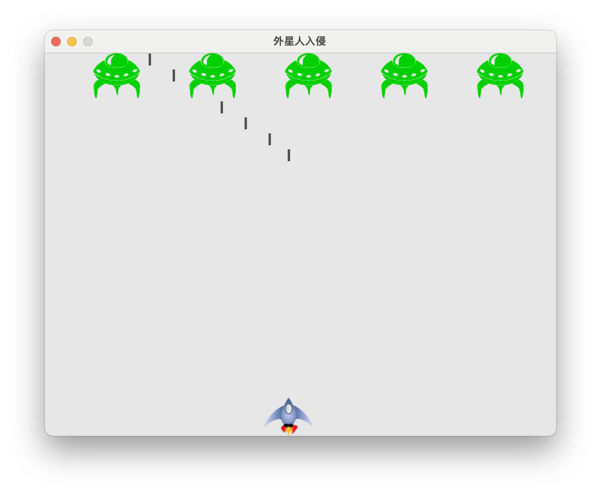
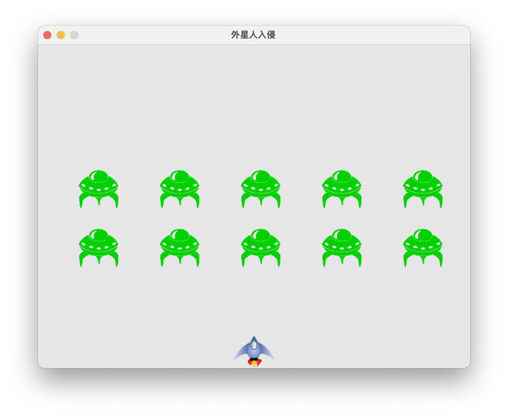
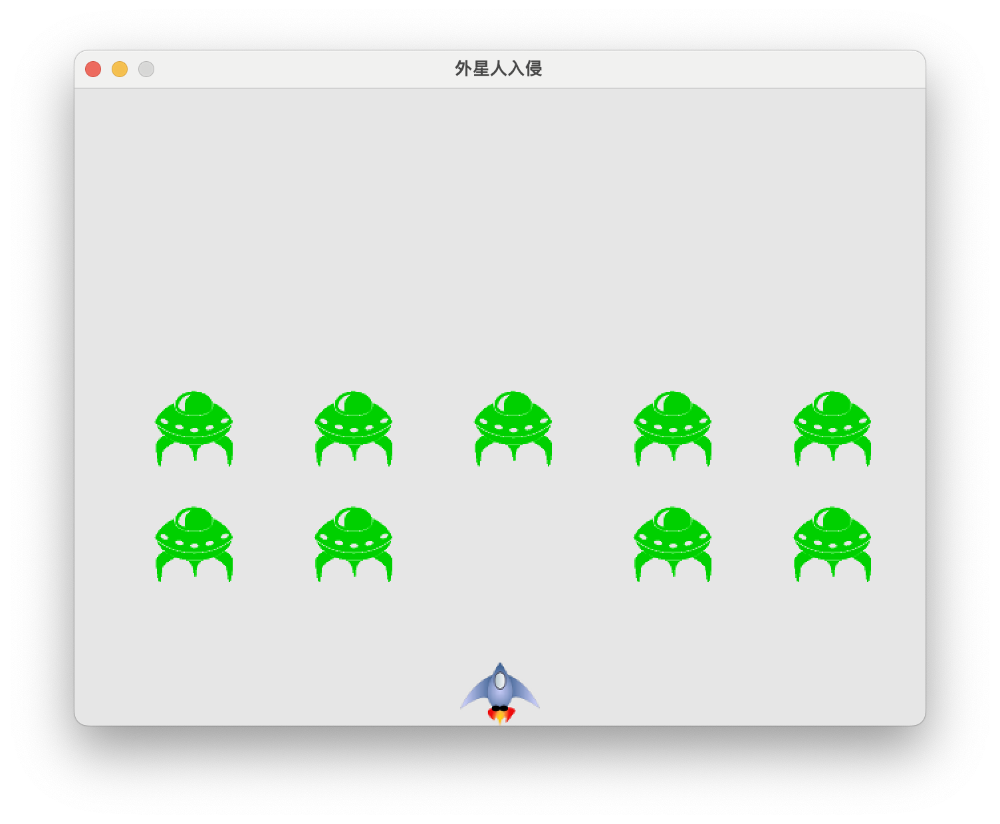
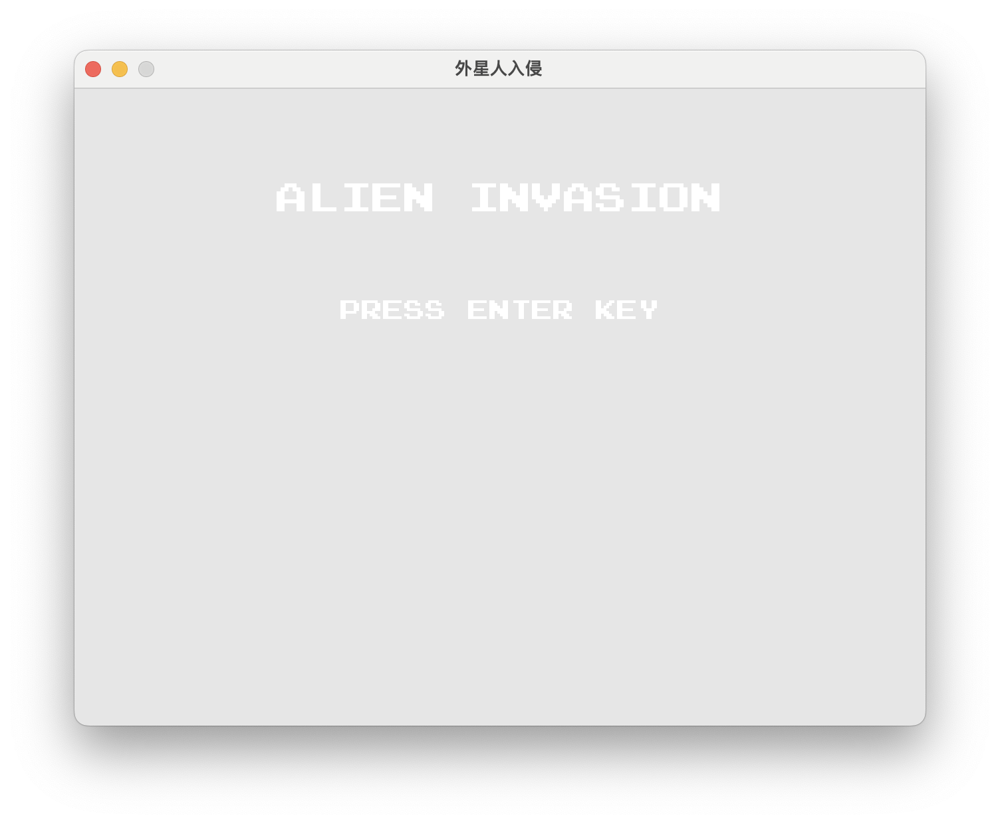
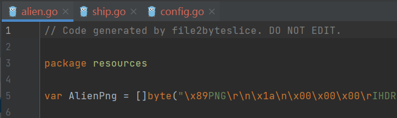
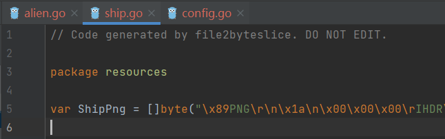
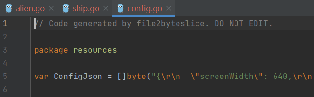
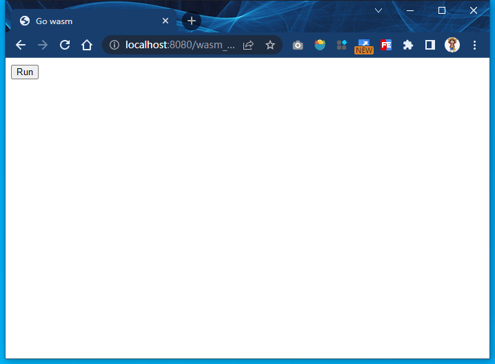
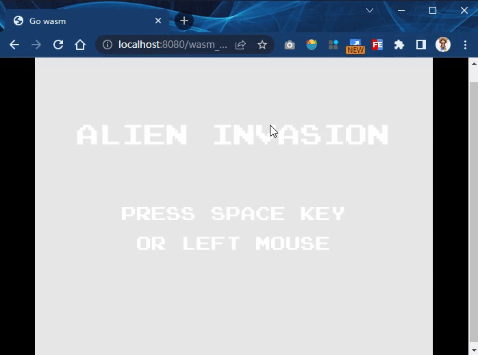

> 该项目主要是利用已知go语言包创建一个小游戏
>
> 官方网站：
>
> https://ebitengine.org/
>
> 仓库地址 ：
> https://github.com/hajimehoshi/ebiten/

# Part1

## 安装

ebitengine 要求Go版本 >= 1.15。使用go module下载这个包：

```shell
go get -u github.com/hajimehoshi/ebiten/v2
```

## 初始化界面

main.go

```go
package main

import (
	"log"

	"github.com/hajimehoshi/ebiten/v2"
	"github.com/hajimehoshi/ebiten/v2/ebitenutil"
)

type Game struct{}

func (g *Game) Update() error {
	return nil
}

func (g *Game) Draw(screen *ebiten.Image) {
	ebitenutil.DebugPrint(screen, "Hello, World")
}

func (g *Game) Layout(outsideWidth, outsideHeight int) (screenWidth, screenHeight int) {
	return 320, 240
}

// 关于Game结构体写三个接口 实现游戏的初始化、更新、渲染

func main() {
	ebiten.SetWindowSize(640, 480)
	ebiten.SetWindowTitle("外星人入侵")
	if err := ebiten.RunGame(&Game{}); err != nil {
		log.Fatal(err)
	}
}

```


首先，ebiten引擎运行时要求传入一个游戏对象，该对象的必须实现`ebiten.Game`这个接口：

```go
// Game defines necessary functions for a game.
type Game interface {
  Update() error
  Draw(screen *Image)
  Layout(outsideWidth, outsideHeight int) (screenWidth, screenHeight int)
}
```

`ebiten.Game`接口定义了ebiten游戏需要的3个方法：`Update`,`Draw`和`Layout`。

- `Update`：每个tick都会被调用。tick是引擎更新的一个时间单位，默认为1/60s。tick的倒数我们一般称为帧，即游戏的更新频率。默认ebiten游戏是60帧，即每秒更新60次。该方法主要用来更新游戏的逻辑状态，例如子弹位置更新。上面的例子中，游戏对象没有任何状态，故`Update`方法为空。注意到`Update`方法的返回值为`error`类型，当`Update`方法返回一个非空的`error`值时，游戏停止。在上面的例子中，我们一直返回nil，故只有关闭窗口时游戏才停止。
- `Draw`：每帧（frame）调用。帧是渲染使用的一个时间单位，依赖显示器的刷新率。如果显示器的刷新率为60Hz，`Draw`将会每秒被调用60次。`Draw`接受一个类型为`*ebiten.Image`的screen对象。ebiten引擎每帧会渲染这个screen。在上面的例子中，我们调用`ebitenutil.DebugPrint`函数在screen上渲染一条调试信息。由于调用`Draw`方法前，screen会被重置，故`DebugPrint`每次都需要调用。
- `Layout`：该方法接收游戏窗口的尺寸作为参数，返回游戏的逻辑屏幕大小。我们实际上计算坐标是对应这个逻辑屏幕的，`Draw`将逻辑屏幕渲染到实际窗口上。这个时候可能会出现伸缩。在上面的例子中游戏窗口大小为(640, 480)，`Layout`返回的逻辑大小为(320, 240)，所以显示会放大1倍。

> Layout是设置逻辑分辨率，而main函数中设置的是实际分辨率
>
> 不想区分这里或者因为尺寸问题造成元素不显示就直接传递数值就好，根据效果对应修改就行了
>
> 比如后面的飞船那里：如果不删去 /2 的话飞船不显示

## 处理输入

没有交互的游戏不是真的游戏！下面我们来监听键盘的输入，当前只处理3个键：左方向←，右方向→和空格。

ebiten提供函数`IsKeyPressed`来判断某个键是否按下，同时内置了100多个键的常量定义，见源码keys.go文件。`ebiten.KeyLeft`表示左方向键，`ebiten.KeyRight`表示右方向键，`ebiten.KeySpace`表示空格。

为了代码清晰，我们定义一个`Input`结构来处理输入：

```go
type Input struct {
  msg string
}

func (i *Input) Update() {
  if ebiten.IsKeyPressed(ebiten.KeyLeft) {
    fmt.Println("←←←←←←←←←←←←←←←←←←←←←←←")
    i.msg = "left pressed"
  } else if ebiten.IsKeyPressed(ebiten.KeyRight) {
    fmt.Println("→→→→→→→→→→→→→→→→→→→→→→→")
    i.msg = "right pressed"
  } else if ebiten.IsKeyPressed(ebiten.KeySpace) {
    fmt.Println("-----------------------")
    i.msg = "space pressed"
  }
}
```

Game结构中添加一个`Input`类型的字段，并且为了方便新增`NewGame`方法用于创建Game对象：

```go
type Game struct {
  input *Input
}

func NewGame() *Game {
  return &Game{
    input: &Input{msg: "Hello, World!"},
  }
}
```

Game结构的`Update`方法中，我们需要调用`Input`的`Update`方法触发按键的判断：

```go
func (g *Game) Update() error {
  g.input.Update()
  return nil
}
```

Game的`Draw`方法中将显示`Input`的`msg`字段：

```go
func (g *Game) Draw(screen *ebiten.Image) {
  ebitenutil.DebugPrint(screen, g.input.msg)
}
```

将main函数中创建Game对象的方式修改如下：

```go
game := NewGame()

if err := ebiten.RunGame(game); err != nil {
  log.Fatal(err)
}
```

修改的完整main.go代码如下；

```go
package main

import (
	"fmt"
	"log"

	"github.com/hajimehoshi/ebiten/v2"
	"github.com/hajimehoshi/ebiten/v2/ebitenutil"
)

type Input struct {
	msg string
}

type Game struct {
	input *Input
}

func NewGame() *Game {
	return &Game{
		input: &Input{msg: "Hello, World!"},
	}
}

// NewGame()函数用于初始化游戏：为Game结构体的信息赋值

func (i *Input) Update() {
	if ebiten.IsKeyPressed(ebiten.KeyLeft) {
		fmt.Println("←←You Pressed Left ←←")
		i.msg = "left pressed"
	} else if ebiten.IsKeyPressed(ebiten.KeyRight) {
		fmt.Println("→→You Pressed Right→→")
		i.msg = "right pressed"
	} else if ebiten.IsKeyPressed(ebiten.KeySpace) {
		fmt.Println("--You Pressed Space--")
		i.msg = "space pressed"
	}
}

// 更新游戏内容显示

func (g *Game) Update() error {
	g.input.Update()
	return nil
}

func (g *Game) Draw(screen *ebiten.Image) {
	ebitenutil.DebugPrint(screen, g.input.msg)
}

func (g *Game) Layout(outsideWidth, outsideHeight int) (screenWidth, screenHeight int) {
	return 320, 240
}

// 关于Game结构体写三个接口 实现游戏的初始化、更新、渲染

func main() {
	ebiten.SetWindowSize(640, 480)
	ebiten.SetWindowTitle("外星人入侵")

	game := NewGame()

	if err := ebiten.RunGame(game); err != nil {
		log.Fatal(err)
	}
}

```

> 核心还是 Updata Draw 和 Layout三个函数，不过嵌套了一个内部结构体实现显示内容的更改

结果如下；


如果你一直按着那么下面的终端就会重复打印信息

## 设置背景

代码如下：（修改Draw函数实现更改背景）

```go
func (g *Game) Draw(screen *ebiten.Image) {
  screen.Fill(color.RGBA{R: 200, G: 200, B: 200, A: 255})
  ebitenutil.DebugPrint(screen, g.input.msg)
}
```

结果如下：


>核心就是 screen.Fill(color.RGBA{R: 200, G: 200, B: 200, A: 255})
>
>通过这行代码进行颜色选择就好，RGBA的具体含义建议google

## 第一次重构

目前为止，我们的实现了显示窗口和处理输入的功能。我们先分析一下目前的程序有哪些问题：

- 所有逻辑都堆在一个文件中，修改不便
- 逻辑中直接出现字面值，例如640/480，字符串"外星人入侵"等，每次修改都需要重新编译程序

在继续之前，我们先对代码组织结构做一次重构，这能让我们走得更远。

为了清晰，方便管理，我们逻辑拆分到4个文件中：

- game.go：编写Game对象，并实现相关方法，同时负责协调其他各个模块
- input.go：输入相关的逻辑
- config.go：专门负责配置相关的逻辑
- main.go：main函数，负责创建Game对象，运行游戏

为了程序的灵活修改，我们将程序中的可变项都作为配置存放在文件中，程序启动时自动读取这个配置文件。我选择json作为配置文件的格式：(json格式用来写配置信息是非常推荐的呢)

config.json

```json
{
  "screenWidth": 640,
  "screenHeight": 480,
  "title": "外星人入侵",
  "bgColor": {
    "r": 230,
    "g": 230,
    "b": 230,
    "a": 255
  }
}
```

然后定义配置的结构和加载配置的函数：

config.go

```golang
package main

import (
	"encoding/json"
	"image/color"
	"log"
	"os"
)

type Config struct {
	ScreenWidth  int        `json:"screenWidth"`
	ScreenHeight int        `json:"screenHeight"`
	Title        string     `json:"title"`
	BgColor      color.RGBA `json:"bgColor"`
}

func loadConfig() *Config {
	f, err := os.Open("./config.json")
	if err != nil {
		log.Fatalf("os.Open failed: %v\n", err)
	}

	var cfg Config
	err = json.NewDecoder(f).Decode(&cfg) // 从文件中读取json数据并解码到cfg中
	if err != nil {
		log.Fatalf("json.Decode failed: %v\n", err)
	}

	return &cfg
}

```

将游戏核心逻辑移到game.go文件中，定义游戏对象结构和创建游戏对象的方法：

game.go

```golang
package main

import (
	"github.com/hajimehoshi/ebiten/v2"
)

type Game struct {
	input *Input
	cfg   *Config
}

func NewGame() *Game {
	cfg := loadConfig()
	ebiten.SetWindowSize(cfg.ScreenWidth, cfg.ScreenHeight)
	ebiten.SetWindowTitle(cfg.Title)

	return &Game{
		input: &Input{
			msg: "hello world",
		},
		cfg: cfg,
	}
}

```

先从配置文件中加载配置，然后根据配置设置游戏窗口大小和标题。拆分之后，`Draw`和`Layout`方法实现如下：

main.go

```golang
package main

import (
	"log"

	"github.com/hajimehoshi/ebiten/v2"
	"github.com/hajimehoshi/ebiten/v2/ebitenutil"
)

// 更新游戏内容显示

func (g *Game) Update() error {
	g.input.Update()
	return nil
}

func (g *Game) Draw(screen *ebiten.Image) {
	screen.Fill(g.cfg.BgColor)
	ebitenutil.DebugPrint(screen, g.input.msg)
  // 这里的绘制顺序不能搞错
}

func (g *Game) Layout(outsideWidth, outsideHeight int) (screenWidth, screenHeight int) {
	return g.cfg.ScreenWidth / 2, g.cfg.ScreenHeight / 2
}

// 关于Game结构体写三个接口 实现游戏的初始化、更新、渲染

func main() {

	game := NewGame()

	if err := ebiten.RunGame(game); err != nil {
		log.Fatal(err)
	}
}

```

input.go

```go
package main

import (
	"fmt"
	"github.com/hajimehoshi/ebiten/v2"
)

type Input struct {
	msg string
}

// NewGame()函数用于初始化游戏：为Game结构体的信息赋值

func (i *Input) Update() {
	if ebiten.IsKeyPressed(ebiten.KeyLeft) {
		fmt.Println("←←You Pressed Left ←←")
		i.msg = "left pressed"
	} else if ebiten.IsKeyPressed(ebiten.KeyRight) {
		fmt.Println("→→You Pressed Right→→")
		i.msg = "right pressed"
	} else if ebiten.IsKeyPressed(ebiten.KeySpace) {
		fmt.Println("--You Pressed Space--")
		i.msg = "space pressed"
	}
}

```


第一次重构到此完成，现在来看一下文件结构，是否更清晰了呢？

```fallback
├── config.go
├── config.json
├── game.go
├── input.go
└── main.go
```

注意，因为拆分成了多个文件，所以运行程序不能再使用`go run main.go`命令了，需要改为`go run .`


> 效果与之前的整体性代码保持一致

## 显示图片

接下来我们尝试在屏幕底部中心位置显示一张飞船的图片：


ebitengine引擎提供了`ebitenutil.NewImageFromFile`函数，传入图片路径即可加载该图片，so easy。为了很好的管理游戏中的各个实体，我们给每个实体都定义一个结构。先定义飞船结构：

ship.go

```go
package main

import (
    "log"

    "github.com/hajimehoshi/ebiten/v2"
    "github.com/hajimehoshi/ebiten/v2/ebitenutil"
)

type Ship struct {
    image  *ebiten.Image
    width  int
    height int
}

func NewShip() *Ship {
	// 用ebiten自带的就能解析png图片
    img, _, err := ebitenutil.NewImageFromFile("../resource/ship.png")
    if err != nil {
        log.Fatal(err)
    }

  	// 通过对象获取width和height然后直接传递数值就行
    width, height := img.Size()
    ship := &Ship{
        image:  img,
        width:  width,
        height: height,
    }

    return ship
}
```

Go标准库提供了三种格式的解码包，`image/png`，`image/jpeg`，`image/gif`。也就是说标准库中没有bmp格式的解码包，所幸golang.org/x仓库没有让我们失望，golang.org/x/image/bmp提供了解析bmp格式图片的功能。我们这里不需要显式的使用对应的图片库，故使用`import _`这种方式，让`init`函数产生副作用。

然后在游戏对象中添加飞船类型的字段：

```golang
func NewGame() *Game {
  // 相同的代码省略...
  return &Game {
    input:   &Input{},
    ship:  NewShip(),
    cfg:  cfg,
  }
}
```

为了将飞船显示在屏幕底部中央位置，我们需要计算坐标。ebitengine采用如下所示的二维坐标系：


x轴向右，y轴向下，左上角为原点。我们需要计算飞船左上角的位置。由上图很容易计算出：

```fallback
x=(W1-W2)/2
y=H1-H2
```

为了在屏幕上显示飞船图片，我们需要调用`*ebiten.Image`的`DrawImage`方法，该方法的第二个参数可以用于指定坐标相对于原点的偏移：

```golang
func (g *Game) Draw(screen *ebiten.Image) {
  screen.Fill(g.cfg.BgColor)
  op := &ebiten.DrawImageOptions{}
  op.GeoM.Translate(float64(g.cfg.ScreenWidth-g.ship.width)/2, float64(g.cfg.ScreenHeight-g.ship.height))
  screen.DrawImage(g.ship.image, op)
}
```

我们给`Ship`类型增加一个绘制自身的方法，传入屏幕对象screen和配置，让代码更好维护：

```golang
func (ship *Ship) Draw(screen *ebiten.Image, cfg *Config) {
    op := &ebiten.DrawImageOptions{}
    op.GeoM.Translate(float64(cfg.ScreenWidth-ship.width)/2, float64(cfg.ScreenHeight-ship.height))
    screen.DrawImage(ship.image, op)
}
```

main.go函数中的Draw就可以简化为：

```go
func (g *Game) Draw(screen *ebiten.Image) {
    screen.Fill(g.cfg.BgColor)
    g.ship.Draw(screen, g.cfg)
}
```

文件结构如下；

> 相比于上一步多了`ship.go`然后修改下game结构体和main函数即可

```bash
mobai@mobaideAir Project5 % tree .
.
├── backup
│   └── main.go
├── config.go
├── config.json
├── game.go
├── go.mod
├── go.sum
├── input.go
├── main.go
├── resource
│   └── ship.png
└── ship.go
```

为了防止歧义或者哪步搞错，下面给出完整的`main.go`和`ship.go`

main.go

```go
package main

import (
	"log"

	"github.com/hajimehoshi/ebiten/v2"
)

// 更新游戏内容显示

func (g *Game) Update() error {
	g.input.Update()
	return nil
}

func (g *Game) Draw(screen *ebiten.Image) {
	screen.Fill(g.cfg.BgColor) // 绘制背景
	g.ship.Draw(screen, g.cfg) // 绘制飞船
}

func (g *Game) Layout(outsideWidth, outsideHeight int) (screenWidth, screenHeight int) {
	return g.cfg.ScreenWidth, g.cfg.ScreenHeight
}

// 这里不用除以2 直接返回config.json中的尺寸大小即可， /2 之后飞船绘制不出来

// 关于Game结构体写三个接口 实现游戏的初始化、更新、渲染

func main() {

	game := NewGame()

	if err := ebiten.RunGame(game); err != nil {
		log.Fatal(err)
	}
}

```

ship.go

```go
package main

import (
	"fmt"
	"log"

	"github.com/hajimehoshi/ebiten/v2"
	"github.com/hajimehoshi/ebiten/v2/ebitenutil"
)

type Ship struct {
	image  *ebiten.Image
	width  int
	height int
}

func NewShip() *Ship {
	// 用ebiten自带的就能解析png图片
	img, _, err := ebitenutil.NewImageFromFile("resource/ship.png")
	if err != nil {
		log.Fatal(err)
	}

	width, height := img.Size()
	fmt.Println("width:", width, "height:", height)
	// 能够获取到尺寸 60 48 呢 那么应该不是飞船对象问题导致的图片加载失败
	ship := &Ship{
		image:  img,
		width:  width,
		height: height,
	}

	return ship
}

func (ship *Ship) Draw(screen *ebiten.Image, cfg *Config) {
	op := &ebiten.DrawImageOptions{}
	op.GeoM.Translate(float64(cfg.ScreenWidth-ship.width)/2, float64(cfg.ScreenHeight-ship.height))
	// 这里是做了减法运算获取到飞船的左上角位置，是的飞船位于中心位置
	screen.DrawImage(ship.image, op)
	// fmt.Println("draw ship") 是一直在绘制中
}

```

运行结果如下：


> 可见 飞船 是正好在绘制窗口的正中间显示的：达到了我们想要的结构

## 移动飞船

现在我们来实现使用左右方向键来控制飞船的移动。首先给飞船的类型增加x/y坐标字段：

> 修改ship.go里面的Ship结构体

```go
type Ship struct {
    // 与前面的代码一样
    x float64 // x坐标
    y float64 // y坐标
}
```

我们前面已经计算出飞船位于屏幕底部中心时的坐标，在创建飞船时将该坐标赋给xy：

> 修改ship.go里面的NewShip函数

```go
func NewShip(screenWidth, screenHeight int) *Ship {
  ship := &Ship{
    // ...
    x: float64(screenWidth-width) / 2,
    y: float64(screenHeight - height),
  }

  return ship
}
```

由于`NewShip`计算初始坐标需要屏幕尺寸，故增加屏幕宽、高两个参数，由`NewGame`方法传入：

> 也就是上面NewShip中所需要使用的两个参数： screenWidth和screeenHeight  修改game.go里面的NewGame函数

```golang
func NewGame() *Game {
  // 与上面的代码一样

  return &Game{
    input: &Input{},
    ship:  NewShip(cfg.ScreenWidth, cfg.ScreenHeight),  // 添加这里传入两个参数
    cfg:   cfg,
  }
}
```

然后我们在`Input`的`Update`方法中根据按下的是左方向键还是右方向键来更新飞船的坐标：

> 修改input.go里面的Update函数

```golang
type Input struct{}

func (i *Input) Update(ship *Ship) {
  if ebiten.IsKeyPressed(ebiten.KeyLeft) {
    ship.x -= 1
  } else if ebiten.IsKeyPressed(ebiten.KeyRight) {
    ship.x += 1
  }
}
// 传入的是一个ship对象，然后对其x进行修改就行了
```

由于需要修改飞船坐标，`Game.Update`方法调用`Input.Update`时需要传入飞船对象：

> 修改main.go里面的Update函数

```golang
func (g *Game) Update() error {
  g.input.Update(g.ship)
  return nil
}
```


> 修改好上面提到的几个点，结果如下：  go run .

> 测试发现无法 正常改变x轴的坐标位置
>
> 找到ship的绘制有问题修改如下

```go
package main

import (
	"log"

	"github.com/hajimehoshi/ebiten/v2"
	"github.com/hajimehoshi/ebiten/v2/ebitenutil"
)

type Ship struct {
	image  *ebiten.Image
	width  int
	height int
	x      float64 // x坐标
	y      float64 // y坐标
}

// 在game.go那里实现传入这两个参数
func NewShip(screenWidth int, screenHeight int) *Ship {
	// 用ebiten自带的就能解析png图片
	img, _, err := ebitenutil.NewImageFromFile("resource/ship.png")
	if err != nil {
		log.Fatal(err)
	}

	width, height := img.Size()
	// fmt.Println("width:", width, "height:", height)
	// 能够获取到尺寸 60 48 呢 那么应该不是飞船对象问题导致的图片加载失败
	ship := &Ship{
		image:  img,
		width:  width,
		height: height,
		x:      float64(screenWidth-width) / 2,
		y:      float64(screenHeight - height),
	}
	// 这里传值的时候就已经界定好了x和y，所以下面的Draw函数直接填写就行

	return ship
}

func (ship *Ship) Draw(screen *ebiten.Image, cfg *Config) {
	op := &ebiten.DrawImageOptions{}
	// ship.x = float64(cfg.ScreenWidth-ship.width) / 2
	ship.y = float64(cfg.ScreenHeight - ship.height)
	op.GeoM.Translate(ship.x, ship.y)
	// 这里是做了减法运算获取到飞船的左上角位置，是的飞船位于中心位置
	screen.DrawImage(ship.image, op)
	// fmt.Println("draw ship") 是一直在绘制中
}

// 未实现移动时因为这里Draw的op.GeoM.Translate是固定的，所以飞船不会移动
// emm

```

移动如下：


注意到，目前有两个问题：

- 移动太慢
- 可以移出屏幕

修改`config.json`如下

```json
"shipSpeedFactor": 3
```

修改`config.go`里面的config结构体：

```golang
type Config struct {
    // 一样的代码
    ShipSpeedFactor float64    `json:"shipSpeedFactor"`
}
```

修改`Input.Update`方法，每次更新`ShipSpeedFactor`个像素：

```golang
func (i *Input) Update(ship *Ship, cfg *Config) {
  if ebiten.IsKeyPressed(ebiten.KeyLeft) {
    ship.x -= cfg.ShipSpeedFactor
  } else if ebiten.IsKeyPressed(ebiten.KeyRight) {
    ship.x += cfg.ShipSpeedFactor
  }
}
```

因为在`Input.Update`方法中需要访问配置，因此增加`Config`类型的参数，由`Game.Update`方法传入：

```golang
func (g *Game) Update() error {
  g.input.Update(g.ship, g.cfg)
  return nil
}
```

> 修改成功，小船的移动速度快了很多，也很方便的修改一些参数信息：关于小船的出界问题见Part2


# Part2

## 限制飞船的活动范围

上一篇文章还留了个尾巴，细心的同学应该发现了：飞船可以移动出屏幕！！！现在我们就来限制一下飞船的移动范围。我们规定飞船可以左右超过半个身位，如下图所示：


很容易计算得出，左边位置的x坐标为：

```
x = -W2/2
```

右边位置的坐标为：

```
x = W1 - W2/2
```

修改input.go的代码如下：

```golang
func (i *Input) Update(ship *Ship, cfg *Config) {
	if ebiten.IsKeyPressed(ebiten.KeyLeft) {
		ship.x -= cfg.ShipSpeedFactor
		if ship.x < -float64(ship.width)/2 {
			ship.x = -float64(ship.width) / 2
		}
	} else if ebiten.IsKeyPressed(ebiten.KeyRight) {
		ship.x += cfg.ShipSpeedFactor
		if ship.x > float64(cfg.ScreenWidth)-float64(ship.width)/2 {
			ship.x = float64(cfg.ScreenWidth) - float64(ship.width)/2
		}
	}
}

// 增加两个if语句实现越界检测即可
```

效果自行实践。可以实现飞机主体尽量不越出界了


## 发射子弹

我们不用另外准备子弹的图片，直接画一个矩形就ok。为了可以灵活控制，我们将子弹的宽、高、颜色以及速率都用配置文件来控制：

修改 `config.json` 如下

```json
{
  "_comment1": "下面是屏幕信息",
  "screenWidth": 640,
  "screenHeight": 480,
  "title": "外星人入侵",
  "bgColor": {
    "r": 230,
    "g": 230,
    "b": 230,
    "a": 255
  },
  "_comment2": "下面是飞船速度",
  "shipSpeedFactor": 3,
  "_comment3": "下面是子弹信息",
  "bulletWidth": 3,
  "bulletHeight": 15,
  "bulletSpeedFactor": 2,
  "bulletColor": {
    "r": 80,
    "g": 80,
    "b": 80,
    "a": 255
  }
}
```

> 注意 json 中不能直接放入注释信息，json5中可以放入注释信息，json中可以通过上面的方式子放入注释信息

新增一个文件bullet.go，定义子弹的结构类型和New方法：

`bullet.go`

```go
package main

import (
	"github.com/hajimehoshi/ebiten/v2"
	"image"
)

// 创建子弹结构体
type Bullet struct {
	image       *ebiten.Image
	width       int
	height      int
	x           float64
	y           float64
	speedFactor float64
}

// 创建子弹创建的方法
func NewBullet(cfg *Config, ship *Ship) *Bullet {
	rect := image.Rect(0, 0, cfg.BulletWidth, cfg.BulletHeight)
	img := ebiten.NewImage(rect.Dx(), rect.Dy())
	img.Fill(cfg.BulletColor)

	return &Bullet{
		image:       img,
		width:       cfg.BulletWidth,
		height:      cfg.BulletHeight,
		x:           ship.x + float64(ship.width-cfg.BulletWidth)/2,
		y:           ship.y - float64(cfg.BulletHeight),
		speedFactor: cfg.BulletSpeedFactor,
	}
}

```

> 子弹的初始化信息 是设置好了

首先根据配置的宽高创建一个rect对象，然后调用`ebiten.NewImageWithOptions`创建一个`*ebiten.Image`对象。

子弹都是从飞船头部发出的，所以它的横坐标等于飞船中心的横坐标，左上角的纵坐标=屏幕高度-飞船高-子弹高。

随便增加子弹的绘制方法：

```golang
func (bullet *Bullet) Draw(screen *ebiten.Image) {
  op := &ebiten.DrawImageOptions{}
  op.GeoM.Translate(bullet.x, bullet.y)
  screen.DrawImage(bullet.image, op)
}
```

> 把这段代码直接放入 `bullet.go` 最下面即可

我们在Game对象中增加一个map来管理子弹：

```golang
type Game struct {
  // -------省略-------
  bullets map[*Bullet]struct{}
}

func NewGame() *Game {
  return &Game{
    // -------省略-------
    bullets: make(map[*Bullet]struct{}),
  }
}
```

然后在`Draw`方法中，我们需要将子弹也绘制出来：

```golang
func (g *Game) Draw(screen *ebiten.Image) {
  screen.Fill(g.cfg.BgColor)
  g.ship.Draw(screen)
  for bullet := range g.bullets {
    bullet.Draw(screen)
  }
}
```

子弹位置如何更新呢？在`Game.Update`中更新，与飞船类似，只是飞船只能水平移动，而子弹只能垂直移动。

```golang
func (g *Game) Update() error {
  for bullet := range g.bullets {
    bullet.y -= bullet.speedFactor
  }
  // -------省略-------
}
```

子弹的更新、绘制逻辑都完成了，可是我们还没有子弹！现在我们就来实现按空格发射子弹的功能。我们需要在`Input.Update`方法中判断空格键是否按下，由于该方法需要访问Game对象的多个字段，干脆传入Game对象： 修改 input.go 文件

> 这里修改了 `input.go` 中的Update函数及其传入的参数，所以需要修改 `main.go` 中的参数信息：直接传入整个game对象

```golang
func (i *Input) Update(g *Game) {
	if ebiten.IsKeyPressed(ebiten.KeyLeft) {
		g.ship.x -= g.cfg.ShipSpeedFactor
		if g.ship.x < -float64(g.ship.width)/2 {
			g.ship.x = -float64(g.ship.width) / 2
		}
	} else if ebiten.IsKeyPressed(ebiten.KeyRight) {
		g.ship.x += g.cfg.ShipSpeedFactor
		if g.ship.x > float64(g.cfg.ScreenWidth)-float64(g.ship.width)/2 {
			g.ship.x = float64(g.cfg.ScreenWidth) - float64(g.ship.width)/2
		}
	} else if ebiten.IsKeyPressed(ebiten.KeySpace) {
		bullet := NewBullet(g.cfg, g.ship)
		g.addBullet(bullet)
	}
}
```

对应修改的main.go中的 Update如下：

```go
func (g *Game) Update() error {
	g.input.Update(g)
	for bullet := range g.bullets {
		bullet.y -= bullet.speedFactor
	}
	// 子弹移动
	return nil
}
```

给Game对象增加一个`addBullet`方法：

```golang
func (g *Game) addBullet(bullet *Bullet) {
  g.bullets[bullet] = struct{}{}
}
```

直接运行结果如下：


可见子弹绘制逻辑和绘制实现了，目前有两个问题：

- 无法一边移动一边发射，仔细看看`Input.Update`方法中的代码，你能发现什么问题吗？
- 子弹太多了，我们想要限制子弹的数量。

下面来逐一解决这些问题。

第一个问题很好解决，因为在KeyLeft/KeyRight/KeySpace这三个判断中我们用了if-else。这样会优先处理移动的操作。将KeySpace移到一个单独的if中即可：

```go
func (i *Input) Update(g *Game) {
  // -------省略-------
  if ebiten.IsKeyPressed(ebiten.KeySpace) {
    bullet := NewBullet(g.cfg, g.ship)
    g.addBullet(bullet)
  }
}
```

第二个问题，在配置中，增加同时最多存在的子弹数：

> 实测 23 颗子弹可以确保从飞机头部到界面的最高部分以及能发射出子弹，发射完毕之后也能无缝衔接上去

```json
{
  "maxBulletNum": 23
}
```

```golang
type Config struct {
  MaxBulletNum      int        `json:"maxBulletNum"`
}
```

然后我们在`Input.Update`方法中判断，如果目前存在的子弹数小于`MaxBulletNum`才能创建新的子弹：

```golang
if ebiten.IsKeyPressed(ebiten.KeySpace) {
  if len(g.bullets) < g.cfg.MaxBulletNum {
    bullet := NewBullet(g.cfg, g.ship)
    g.addBullet(bullet)
  }
}
```

那么修改好的`input.go` 里面的 Update 函数如下：
```go
func (i *Input) Update(g *Game) {
	if ebiten.IsKeyPressed(ebiten.KeyLeft) {
		g.ship.x -= g.cfg.ShipSpeedFactor
		if g.ship.x < -float64(g.ship.width)/2 {
			g.ship.x = -float64(g.ship.width) / 2
		}
	} else if ebiten.IsKeyPressed(ebiten.KeyRight) {
		g.ship.x += g.cfg.ShipSpeedFactor
		if g.ship.x > float64(g.cfg.ScreenWidth)-float64(g.ship.width)/2 {
			g.ship.x = float64(g.cfg.ScreenWidth) - float64(g.ship.width)/2
		}
	}
	// 修改这里为else 也就是飞船发射子弹的逻辑和左右移动是无关的
	if ebiten.IsKeyPressed(ebiten.KeySpace) {
		if len(g.bullets) < g.cfg.MaxBulletNum {
			bullet := NewBullet(g.cfg, g.ship)
			g.addBullet(bullet)
		}
	}
}
```


数量好像被限制了，但是不是我们配置的23,原来`Input.Update()`的调用间隔太短了，导致我们一次space按键会发射多个子弹。我们可以控制两个子弹之间的时间间隔。同样用配置文件来控制（单位毫秒）： 实际测试 150ms 比较合适

```json
{
  "bulletInterval": 150
}
```

```golang
type Config struct {
  BulletInterval    int64      `json:"bulletInterval"`
}
```

在`Input`结构中增加一个`lastBulletTime`字段记录上次发射子弹的时间：

```golang
type Input struct {
  lastBulletTime time.Time
}
```

距离上次发射子弹的时间大于`BulletInterval`毫秒，才能再次发射，发射成功之后更新时间

```golang
func (i *Input) Update(g *Game) {
  // -------省略-------
  	if ebiten.IsKeyPressed(ebiten.KeySpace) {
      if len(g.bullets) < g.cfg.MaxBulletNum &&
        time.Since(i.lastBulletTime).Milliseconds() > g.cfg.BulletInterval {
        bullet := NewBullet(g.cfg, g.ship)
        g.addBullet(bullet)
        i.lastBulletTime = time.Now()
      }
	}
}
```

又出现了一个问题，23个子弹飞出屏幕外之后还是不能发射子弹。我们需要把离开屏幕的子弹删除。这适合在`Game.Update`函数中做：

```golang
func (g *Game) Update() error {
	g.input.Update(g)
	for bullet := range g.bullets {
		bullet.y -= bullet.speedFactor
		if bullet.outOfScreen() {
			delete(g.bullets, bullet)
		}
	}
	// 子弹移动
	return nil
}
```

为了`Bullet`添加判断是否处于屏幕外的方法：

```golang
func (bullet *Bullet) outOfScreen() bool {
  return bullet.y < -float64(bullet.height)
}
```

> 结果是 全屏幕可以无缝衔接子弹

## 外星人来了

外星人图片如下：


同飞船一样，编写Alien类，添加绘制自己的方法：

添加 `alien.go`

```go
package main

import (
	"github.com/hajimehoshi/ebiten/v2"
	"github.com/hajimehoshi/ebiten/v2/ebitenutil"
	"log"
)	

type Alien struct {
	image       *ebiten.Image
	width       int
	height      int
	x           float64
	y           float64
	speedFactor float64
}

func NewAlien(cfg *Config) *Alien {
	img, _, err := ebitenutil.NewImageFromFile("../images/alien.png")
	if err != nil {
		log.Fatal(err)
	}

	width, height := img.Size()
	return &Alien{
		image:       img,
		width:       width,
		height:      height,
		x:           0,
		y:           0,
		speedFactor: cfg.AlienSpeedFactor,
	}
}

func (alien *Alien) Draw(screen *ebiten.Image) {
	op := &ebiten.DrawImageOptions{}
	op.GeoM.Translate(alien.x, alien.y)
	screen.DrawImage(alien.image, op)
}

```

游戏开始时需要创建一组外星人，计算一行可以容纳多少个外星人，考虑到左右各留一定的空间，两个外星人之间留一点空间。在游戏一开始就创建一组外星人：

修改 `game.go` 如下所示：
```go
package main

import (
	"github.com/hajimehoshi/ebiten/v2"
)

type Game struct {
	input   *Input
	ship    *Ship
	cfg     *Config
	bullets map[*Bullet]struct{}
	aliens  map[*Alien]struct{}
}

func NewGame() *Game {
	cfg := loadConfig()
	ebiten.SetWindowSize(cfg.ScreenWidth, cfg.ScreenHeight)
	ebiten.SetWindowTitle(cfg.Title)

	g := &Game{
		input: &Input{
			msg: "hello world",
		},
		ship:    NewShip(cfg.ScreenWidth, cfg.ScreenHeight),
		cfg:     cfg,
		bullets: make(map[*Bullet]struct{}),
		aliens:  make(map[*Alien]struct{}),
	}
	// 调用 CreateAliens 创建一组外星人
	g.CreateAliens()

	return g
}

func (g *Game) addBullet(bullet *Bullet) {
	g.bullets[bullet] = struct{}{}
}

func (g *Game) addAlien(alien *Alien) {
	g.aliens[alien] = struct{}{}
}

func (g *Game) CreateAliens() {
	alien := NewAlien(g.cfg)

	availableSpaceX := g.cfg.ScreenWidth - 2*alien.width
	numAliens := availableSpaceX / (2 * alien.width)+1   // +1 刚好铺满我的屏幕，具体参考你自己

	for i := 0; i < numAliens; i++ {
		alien = NewAlien(g.cfg)
		alien.x = float64(alien.width + 2*alien.width*i)
		g.addAlien(alien)
	}
}

```

左右各留一个外星人宽度的空间：

```
availableSpaceX := g.cfg.ScreenWidth - 2*alien.width 
```

然后，两个外星人之间留一个外星人宽度的空间。所以一行可以创建的外星人的数量为：

```
numAliens := availableSpaceX / (2 * alien.width) 
```

创建一组外星人，依次排列。

同样地，我们需要在`Game.Draw`方法中添加绘制外星人的代码：

```golang
func (g *Game) Draw(screen *ebiten.Image) {
  // -------省略-------
  for alien := range g.aliens {
    alien.Draw(screen)
  }
}
```

运行结果如下；


修改`config.json` 添加移动速度，记得修改相应的`config.go`

```json
{
  "_comment1": "下面是屏幕信息",
  "screenWidth": 640,
  "screenHeight": 480,
  "title": "外星人入侵",
  "bgColor": {
    "r": 230,
    "g": 230,
    "b": 230,
    "a": 255
  },
  "_comment2": "下面是飞船速度",
  "shipSpeedFactor": 3,
  "_comment3": "下面是子弹信息",
  "bulletWidth": 3,
  "bulletHeight": 15,
  "bulletSpeedFactor": 2,
  "bulletColor": {
    "r": 80,
    "g": 80,
    "b": 80,
    "a": 255
  },
  "_comment4": "对子弹和发射时间间隔做点限制",
  "maxBulletNum": 23,
  "bulletInterval": 150,
  "_comment5": "下面是外星人信息",
  "alienSpeedFactor": 0.7
}
```

```go
	AlienSpeedFactor  float64    `json:"alienSpeedFactor"`
```

修改`game.go` 让外星人动起来:

```golang
package main

import (
	"github.com/hajimehoshi/ebiten/v2"
)

type Game struct {
	input   *Input
	ship    *Ship
	cfg     *Config
	bullets map[*Bullet]struct{}
	aliens  map[*Alien]struct{}
}

func NewGame() *Game {
	cfg := loadConfig()
	ebiten.SetWindowSize(cfg.ScreenWidth, cfg.ScreenHeight)
	ebiten.SetWindowTitle(cfg.Title)

	g := &Game{
		input: &Input{
			msg: "hello world",
		},
		ship:    NewShip(cfg.ScreenWidth, cfg.ScreenHeight),
		cfg:     cfg,
		bullets: make(map[*Bullet]struct{}),
		aliens:  make(map[*Alien]struct{}),
	}
	// 调用 CreateAliens 创建一组外星人
	g.CreateAliens()

	return g
}

func (g *Game) addBullet(bullet *Bullet) {
	g.bullets[bullet] = struct{}{}
}

func (g *Game) addAlien(alien *Alien) {
	g.aliens[alien] = struct{}{}
}

func (g *Game) CreateAliens() {
	alien := NewAlien(g.cfg)

	availableSpaceX := g.cfg.ScreenWidth - 2*alien.width
	numAliens := availableSpaceX/(2*alien.width) + 1

	for i := 0; i < numAliens; i++ {
		alien = NewAlien(g.cfg)
		alien.x = float64(alien.width + 2*alien.width*i)
		g.addAlien(alien)
	}

	for row := 0; row < 2; row++ {
		for i := 0; i < numAliens; i++ {
			alien = NewAlien(g.cfg)
			alien.x = float64(alien.width + 2*alien.width*i)
			alien.y = float64(alien.height*row) * 1.5
			g.addAlien(alien)
		}
	}
}

```

让外星人都起来，同样地还是在`Game.Update`方法中更新位置：

```go
func (g *Game) Update() error {
	g.input.Update(g)
	// 子弹移动
	for bullet := range g.bullets {
		bullet.y -= bullet.speedFactor
		if bullet.outOfScreen() {
			delete(g.bullets, bullet)
		}
	}

	for alien := range g.aliens {
		alien.y += alien.speedFactor
	}

	// g.CheckCollision()  这里是后面碰撞检测需要用到的函数，如果只看外星人移动可以把这里注释掉
	return nil
}
```




>  非常的 Perfect

## 射击！！

当前子弹碰到外星人直接穿过去了，我们希望能击杀外星人。这需要检查子弹和外星人之间的碰撞。我们新增一个文件collision.go，并编写检查子弹与外星人是否碰撞的函数。这里我采用最直观的碰撞检测方法，即子弹的4个顶点只要有一个位于外星人矩形中，就认为它们碰撞。

```golang
package main

import (
)

// CheckCollision 检查子弹和外星人之间是否有碰撞
func CheckCollision(bullet *Bullet, alien *Alien) bool {
	alienTop, alienLeft := alien.y, alien.x
	alienBottom, alienRight := alien.y+float64(alien.height), alien.x+float64(alien.width)
	// 左上角
	x, y := bullet.x, bullet.y
	if y > alienTop && y < alienBottom && x > alienLeft && x < alienRight {
		return true
	}

	// 右上角
	x, y = bullet.x+float64(bullet.width), bullet.y
	if y > alienTop && y < alienBottom && x > alienLeft && x < alienRight {
		return true
	}

	// 左下角
	x, y = bullet.x, bullet.y+float64(bullet.height)
	if y > alienTop && y < alienBottom && x > alienLeft && x < alienRight {
		return true
	}

	// 右下角
	x, y = bullet.x+float64(bullet.width), bullet.y+float64(bullet.height)
	if y > alienTop && y < alienBottom && x > alienLeft && x < alienRight {
		return true
	}

	return false
}

```

接着我们在`Game.Update`方法中调用这个方法，并且将碰撞的子弹和外星人删除。

```go
func (g *Game) CheckCollision() {
	for bullet := range g.bullets {
		for alien := range g.aliens {
			if CheckCollision(bullet, alien) {
				// fmt.Println("collision")
				delete(g.aliens, alien)
				delete(g.bullets, bullet)
				// fmt.Println("here delete alien")
			}
		}
	}
}
// 这段代码的循环逻辑是经过检测的，外层是子弹才会更合理：不然会导致碰撞检测到了但是删除“外星人”的时候的指针并没有改变


// 更新游戏内容显示
func (g *Game) Update() error {
	g.input.Update(g)
	// 子弹移动
	for bullet := range g.bullets {
		bullet.y -= bullet.speedFactor
		if bullet.outOfScreen() {
			delete(g.bullets, bullet)
		}
	}

	for alien := range g.aliens {
		alien.y += alien.speedFactor
	}

	g.CheckCollision()
	return nil
}
```



> 实现好了击杀判断逻辑，那么接下来就是创建主页面和结束页面啦

## 增加主界面和结束界面

现在一旦运行程序，外星人们就开始运动了。我们想要增加一个按下空格键才开始的功能，并且游戏结束之后，我们也希望能显示一个Game Over的界面。首先，我们定义几个常量，表示游戏当前所处的状态：

编辑`game.go`

```golang
type Mode int

const (
  ModeTitle Mode = iota
  ModeGame
  ModeOver
)
// 三种阶段：开头，游戏和结束
```

Game结构中需要增加mode字段表示当前游戏所处的状态：

```golang
type Game struct {
  mode    Mode
  // ...
}
```

为了显示开始界面，涉及到文字的显示，文字显示和字体处理起来都比较麻烦。ebitengine内置了一些字体，我们可以据此创建几个字体对象：

先处理config配置文件

```json
  "_conment6": "下面是字体信息",
  "titleFontSize": 24.0,
  "fontSize": 16.0,
  "smallFontSize": 12.0
```

config.go里面添加下列信息：

```go
	TitleFontSize     float64    `json:"titleFontSize"`
	FontSize          float64    `json:"fontSize"`
	SmallFontSize     float64    `json:"smallFontSize"`
```

在`main.go`中添加下列代码

```golang
var (
	titleArcadeFont font.Face
	arcadeFont      font.Face
	smallArcadeFont font.Face
)

func (g *Game) CreateFonts() {
	tt, err := opentype.Parse(fonts.PressStart2P_ttf)
	if err != nil {
		log.Fatal(err)
	}
	const dpi = 72
	titleArcadeFont, err = opentype.NewFace(tt, &opentype.FaceOptions{
		Size:    float64(g.cfg.TitleFontSize),
		DPI:     dpi,
		Hinting: font.HintingFull,
	})
	if err != nil {
		log.Fatal(err)
	}
	arcadeFont, err = opentype.NewFace(tt, &opentype.FaceOptions{
		Size:    float64(g.cfg.FontSize),
		DPI:     dpi,
		Hinting: font.HintingFull,
	})
	if err != nil {
		log.Fatal(err)
	}
	smallArcadeFont, err = opentype.NewFace(tt, &opentype.FaceOptions{
		Size:    float64(g.cfg.SmallFontSize),
		DPI:     dpi,
		Hinting: font.HintingFull,
	})
	if err != nil {
		log.Fatal(err)
	}
}

```

`fonts.PressStart2P_ttf`就是ebitengine提供的字体。创建字体的方法一般在需要的时候微调即可。将创建外星人和字体封装在Game的init方法中：

修改 `game.go`

```golang
func (g *Game) init() {
  g.CreateAliens()
  g.CreateFonts()
}

func NewGame() *Game {
  // ...
    g.init()
  return g
}
```

启动时游戏处于ModeTitle状态，处于ModeTitle和ModeOver时只需要在屏幕上显示一些文字即可。只有在ModeGame状态才需要显示飞船和外星人：

修改`main.go`里面的 Draw 函数

```golang
func (g *Game) Draw(screen *ebiten.Image) {
  screen.Fill(g.cfg.BgColor)

  var titleTexts []string
  var texts []string
  switch g.mode {
  case ModeTitle:
    titleTexts = []string{"ALIEN INVASION"}
    texts = []string{"", "", "", "", "", "", "", "PRESS ENTER KEY"}
  case ModeGame:
    g.ship.Draw(screen)
    for bullet := range g.bullets {
      bullet.Draw(screen)
    }
    for alien := range g.aliens {
      alien.Draw(screen)
    }
  case ModeOver:
    texts = []string{"", "GAME OVER!"}
  }

  for i, l := range titleTexts {
    x := (g.cfg.ScreenWidth - len(l)*g.cfg.TitleFontSize) / 2
    text.Draw(screen, l, titleArcadeFont, x, (i+4)*g.cfg.TitleFontSize, color.White)
  }
  for i, l := range texts {
    x := (g.cfg.ScreenWidth - len(l)*g.cfg.FontSize) / 2
    text.Draw(screen, l, arcadeFont, x, (i+4)*g.cfg.FontSize, color.White)
  }
}
```

在`Game.Update`方法中，我们判断在ModeTitle状态下按下空格，鼠标左键游戏开始，切换为ModeGame状态。游戏结束时切换为GameOver状态，在GameOver状态后按下空格或鼠标左键即重新开始游戏。

修改`main.go`方法

```golang
func (g *Game) Update() error {
  switch g.mode {
  case ModeTitle:
    if g.input.IsKeyPressed() {
      g.mode = ModeGame
    }
  case ModeGame:
    for bullet := range g.bullets {
      bullet.y -= bullet.speedFactor
    }

    for alien := range g.aliens {
      alien.y += alien.speedFactor
    }

    g.input.Update(g)

    g.CheckCollision()

    for bullet := range g.bullets {
      if bullet.outOfScreen() {
        delete(g.bullets, bullet)
      }
    }
  case ModeOver:
    if g.input.IsKeyPressed() {
      g.init()
      g.mode = ModeTitle
    }
  }

  return nil
}
```

> 注意g.input.IsKeyPressed()

input.go中增加`IsKeyPressed`方法判断是否有空格或鼠标左键按下。

```go
func (i *Input) IsKeyPressed() bool {
	return ebiten.IsKeyPressed(ebiten.KeyEnter)
}
```

结果如下；



## 判断游戏胜负

我们规定如果击杀所有外星人则游戏胜利，有1个外星人移出屏幕外或者碰撞到飞船则游戏失败。

首先增加一个字段`failCount`用于记录移出屏幕外的外星人数量和与飞船碰撞的外星人数量之和：

```golang
type Game struct {
  // -------省略-------
  failCount int // 被外星人碰撞和移出屏幕的外星人数量之和
}
```

然后我们在`Game.Update`方法中检测外星人是否移出屏幕，以及是否与飞船碰撞：

```golang
for alien := range g.aliens {
  if alien.outOfScreen(g.cfg) {
    g.failCount++
    delete(g.aliens, alien)
    continue
  }

  if CheckCollision(alien, g.ship) {
    g.failCount++
    delete(g.aliens, alien)
    continue
  }
}
```

这里有一个问题，还记得吗？我们前面编写的`CheckCollision`函数接受的参数类型是`*Alien`和`*Bullet`，这里我们需要重复编写接受参数为`*Ship`和`*Alien`的函数吗？不用！


> 下面的方法暂且不用，作为go的拓展性学习使用
>
> 碰撞检测和移出屏幕单独通过函数实现
>
> 但是下面提供的方法还是比较优秀和合理的


我们将表示游戏中的实体对象抽象成一个`GameObject`结构：

```golang
type GameObject struct {
  width  int
  height int
  x      float64
  y      float64
}

func (gameObj *GameObject) Width() int {
  return gameObj.width
}

func (gameObj *GameObject) Height() int {
  return gameObj.height
}

func (gameObj *GameObject) X() float64 {
  return gameObj.x
}

func (gameObj *GameObject) Y() float64 {
  return gameObj.y
}
```

然后定义一个接口`Entity`：

```golang
type Entity interface {
  Width() int
  Height() int
  X() float64
  Y() float64
}
```

最后让我们游戏中的实体内嵌这个`GameObject`对象，即可自动实现`Entity`接口：

```golang
type Alien struct {
  GameObject
  image       *ebiten.Image
  speedFactor float64
}
```

这样`CheckCollision`即可改为接受两个`Entity`接口类型的参数：

```golang
// CheckCollision 两个物体之间是否碰撞
func CheckCollision(entityA, entityB Entity) bool {
  top, left := entityA.Y(), entityA.X()
  bottom, right := entityA.Y()+float64(entityA.Height()), entityA.X()+float64(entityA.Width())
  // 左上角
  x, y := entityB.X(), entityB.Y()
  if y > top && y < bottom && x > left && x < right {
    return true
  }

  // 右上角
  x, y = entityB.X()+float64(entityB.Width()), entityB.Y()
  if y > top && y < bottom && x > left && x < right {
    return true
  }

  // 左下角
  x, y = entityB.X(), entityB.Y()+float64(entityB.Height())
  if y > top && y < bottom && x > left && x < right {
    return true
  }

  // 右下角
  x, y = entityB.X()+float64(entityB.Width()), entityB.Y()+float64(entityB.Height())
  if y > top && y < bottom && x > left && x < right {
    return true
  }

  return false
}
```

如果游戏失败则切换为ModeOver模式，屏幕上显示"Game Over!"。如果游戏胜利，则显示"You Win!"：

```golang
if g.failCount >= 1 {
  g.overMsg = "Game Over!"
} else if len(g.aliens) == 0 {
  g.overMsg = "You Win!"
}

if len(g.overMsg) > 0 {
  g.mode = ModeOver
  g.aliens = make(map[*Alien]struct{})
  g.bullets = make(map[*Bullet]struct{})
}
```

注意，为了下次游戏能顺序进行，这里需要清楚所有的子弹和外星人。

自定义好的碰撞检测代码如下 ：
`confision2.go`

```go
package main

import ()

// CheckCollision 检查飞机和外星人之间是否有碰撞  -- 代码基本上是一致的，直接复刻基本上就可以了
func CheckCollision2(ship *Ship, alien *Alien) bool {
	alienTop, alienLeft := alien.y, alien.x
	alienBottom, alienRight := alien.y+float64(alien.height), alien.x+float64(alien.width)
	// 左上角
	x, y := ship.x, ship.y
	if y > alienTop && y < alienBottom && x > alienLeft && x < alienRight {
		return true
	}

	// 右上角
	x, y = ship.x+float64(ship.width), ship.y
	if y > alienTop && y < alienBottom && x > alienLeft && x < alienRight {
		return true
	}

	// 左下角
	x, y = ship.x, ship.y+float64(ship.height)
	if y > alienTop && y < alienBottom && x > alienLeft && x < alienRight {
		return true
	}

	// 右下角
	x, y = ship.x+float64(ship.width), ship.y+float64(ship.height)
	if y > alienTop && y < alienBottom && x > alienLeft && x < alienRight {
		return true
	}

	return false
}

```

自定义好的 `outOfScreen` 如下

添加到 `alien.go`

```go
func (alien *Alien) outOfScreen(cfg *Config) bool {
	return alien.y+float64(alien.height) < -float64(alien.height) || alien.y+float64(alien.height) > 	float64(cfg.ScreenHeight)
}
```

实现好了碰撞检测和alien走到底部边界


## 总结

本文接着上篇文章，介绍了发射子弹，检测碰撞，增加主界面和游戏结束界面等内容。至此一个简答的游戏就做出来了。可以看出使用ebitengine做一个游戏还是很简单的，非常推荐尝试呢！上手之后，建议看看官方仓库examples目录中的示例，会非常有帮助。

# Part3

### file2byteslice

使用file2byteslice包我们可以将图片和config.json文件打包进二进制程序中，之后编译生成一个二进制程序。然后拷贝这一个文件即可，不用再拷贝图片和其他配置文件了。

golang有很多第三方包可以将打包资源，原理其实很简单——读取资源文件的内容，然后生成一个go文件，在这个文件中创建一个变量保存这个文件的二进制内容。

我们将使用ebiten作者编写的file2byteslice包。首先使用`go install`命令安装它：

```
$ go install github.com/hajimehoshi/file2byteslice 
```

去官方clone仓库然后直接通过go build生成file2byteslice 然后 `./file2byteslice` 运行也是可以的 ：然后兼容 arm架构

file2byteslice的命令格式如下：

```
$ file2byteslice -input INPUT_FILE -output OUTPUT_FILE -package PACKAGE_NAME -var VARIABLE_NAME 
```

故我们可以这样来打包文件：

```cmd
$ file2byteslice -input ../images/ship.png -output resources/ship.go -package resources -var ShipPng
$ file2byteslice -input ../images/alien.png -output resources/alien.go -package resources -var AlienPng
$ file2byteslice -input config.json -output resources/config.go -package resources -var ConfigJson
```

生成文件如下：







​	

> 问题是 生成的 resources 这个包不好使用呢 ./resources 依旧无法使用
>
> 继而改到main包中就可以直接使用啦
>
> 这里不要认为 模块 名是 包名

相应的加载这些文件的代码需要相应的修改：

> 就是将直接文件读取改为 二进制文件读取

```golang
// alien.go
func NewAlien(cfg *Config) *Alien {
  img, _, err := ebitenutil.NewImageFromReader(bytes.NewReader(resources.AlienPng))
  if err != nil {
    log.Fatal(err)
  }
  // ...
}
```


```golang
// ship.go
func NewShip(screenWidth, screenHeight int) *Ship {
  img, _, err := ebitenutil.NewImageFromReader(bytes.NewReader(resources.ShipPng))
  if err != nil {
    log.Fatal(err)
  }
  // ...
}
```


```golang
// config.go
func loadConfig() *Config {
  var cfg Config
  if err := json.NewDecoder(bytes.NewReader(resources.ConfigJson)).Decode(&cfg); err != nil {
    log.Fatalf("json.Decode failed: %v\n", err)
  }

  return &cfg
}
```


然后，我们就可以编译成一个游戏二进制程序随意拷贝到其他电脑上运行了：

```
$ go build -o alien_invasion 
```

### go generate

前面先安装file2byteslice程序，然后一个命令一个命令地执行打包，操作起来很是繁琐。如果有文件修改，这个过程又需要来一次。

实际上，我们可以使用`go generate`让上面的过程更智能一点。在main.go文件中添加如下几行注释：

```golang
//go:generate go install github.com/hajimehoshi/file2byteslice
//go:generate mkdir resources
//go:generate file2byteslice -input ../images/ship.png -output resources/ship.go -package resources -var ShipPng
//go:generate file2byteslice -input ../images/alien.png -output resources/alien.go -package resources -var AlienPng
//go:generate file2byteslice -input config.json -output resources/config.go -package resources -var ConfigJson
```

注意，`//`和`go:generate`之间一定不能有空格，一定不能有空格，一定不能有空格，重要的事情说3遍！然后执行下面的命令即可完成安装file2byteslice和打包资源的工作：

```
$ go generate 
```

## 让游戏在网页上运行

借助于wasm的强大功能，我们的游戏可以很好地在web上运行！为了让程序能够在网页上运行，我们需要将其编译成wasm。Go内置对wasm的支持。编译方式如下：

```
$ GOOS=js GOARCH=wasm go build -o alien_invasion.wasm 
```

Go提供的胶水代码，将位于`$GOROOT/misc/wasm`目录下的wasm_exec.html和wasm_exec.js文件拷贝到我们的项目目录下。注意wasm_exec.html文件中默认是加载名为test.wasm的文件，我们需要将加载文件改为alien_invasion.wasm，或者将生成的文件改名为test.wasm。

然后编写一个简单的web服务器：

```golang
package main

import (
  "log"
  "net/http"
)

func main() {
  if err := http.ListenAndServe(":8080", http.FileServer(http.Dir("."))); err != nil {
    log.Fatal(err)
  }
}
```

运行：

```
$ go run main.go 
```

打开浏览器输入地址：localhost:8080/wasm_exec.html。




点击run按钮即可愉快地玩耍啦！



## 项目的不足

到目前为止，我们的游戏基本上可玩，但是还有很多的不足：

- 没有声音！
- 外星人没有横向的运动！
- 分数都没有！

## 总结

接着上文，本文介绍了如何将资源文件打包进一个二进制程序中，方便相互之间的传播。然后我们不费吹灰之力就将这个游戏移至到了网页之中。

总的来说ebiten是一款简单、易上手的2D游戏开发引擎。对游戏开发感兴趣的童鞋可以使用它来快速开发，引起自己的兴趣。用它来开发一些小游戏也是得心应手，而且自带跨平台功能，十分方便。但是，大型、复杂游戏的开发还是要借助专业的引擎。


## 关于 `go build`

> 该篇目主要介绍go项目如何打包

### 一般情况

> 使用 go build 可以解决大部分打包的情况

-o 选项用于指定输出文件的名称。如果不使用 -o 选项，默认情况下，生成的可执行文件名称与包含 main 函数的源文件或模块名称相同。

关于go build

1. go build
   这条命令会编译当前目录下的所有 Go 源文件，并生成一个可执行文件。默认情况下，生成的可执行文件名称与包含 main 函数的源文件或模块名称相同。
2. go build -o myapp
   使用 -o 选项可以指定输出文件的名称。例如，上面的命令会将编译生成的可执行文件命名为 myapp。
3. go build main.go
   这条命令会编译 main.go 文件，并生成一个可执行文件，默认名称为 main。
4. go build ./path/to/package
   这条命令会编译指定路径下的包。
5. GOOS=linux GOARCH=amd64 go build
   通过设置环境变量 GOOS 和 GOARCH，可以为不同的操作系统和架构进行交叉编译。
6. go build -ldflags="-s -w"
   使用 -ldflags="-s -w" 可以减小生成的可执行文件的大小，禁用符号表和调试信息。

### 相对路径

#### 使用绝对路径

> 不推荐，这里不诠释了

#### 使用其他方法

示例json
`config.json`

```json
{
  "titleFontSize": 24.0,
  "fontSize": 16.0,
  "smallFontSize": 12.0
}
```

示例main.go
`main.go`

```go
package main

import (
	"embed"
	"encoding/json"
	"fmt"
	"log"
)

//go:embed config.json
var configFile embed.FS

type Config struct {
	TitleFontSize float64 `json:"titleFontSize"`
	FontSize      float64 `json:"fontSize"`
	SmallFontSize float64 `json:"smallFontSize"`
}

func loadConfig() (*Config, error) {
	data, err := configFile.ReadFile("config.json")
	if err != nil {
		return nil, err
	}
	var cfg Config
	if err := json.Unmarshal(data, &cfg); err != nil {
		return nil, err
	}
	return &cfg, nil
}

func main() {
	cfg, err := loadConfig()
	if err != nil {
		log.Fatalf("failed to load config: %v", err)
	}
	// 使用 cfg
	fmt.Printf("Title Font Size: %.2f\n", cfg.TitleFontSize)
	fmt.Printf("Font Size: %.2f\n", cfg.FontSize)
	fmt.Printf("Small Font Size: %.2f\n", cfg.SmallFontSize)
}
```

> 结果是可以正常运行，不会报文件错误
